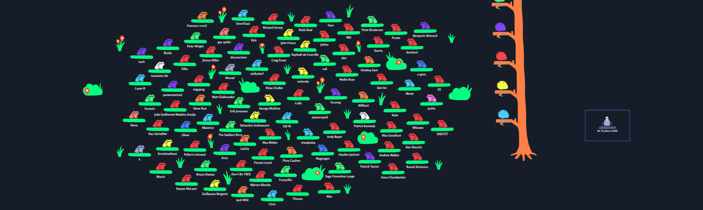
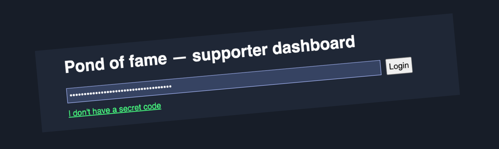
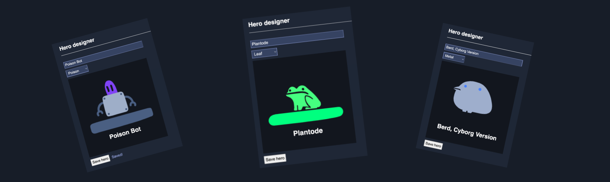

> This update is for [paying supporters](https://patreon.com/TodePond) of my work. 
> It's provided here, DRM-free :) 
> Please only read or listen if you've paid!

<input id="paid-checkbox" type="checkbox"><label for="paid-checkbox">Tick this box if you've paid!</label>

# CHOOSE: Your hero

<audio controls>
  <source src="1.m4a" type="audio/x-m4a">
</audio>

Welcome back to another weekly episode of the...

No, this isn't a TODEPOND PONDCAST. This is an update where I ask you to CHOOSE something.

These were way more common back in the day. Those of you who've been around for a while will remember them. Recently, I've been working slower, so there haven't been so many. But the new video is getting gradually closer... so here we are again!

## Pond of fame

At the end of every video, I thank all my paying supporters. That's YOU.

I do this by showing the [POND of FAME](https://todepond.com/fame). Every supporter gets a spot in the Pond. You get to choose your colour, and your nametag. You get represented by a little creature: a frog, a bird, or a bot. Currently, this is linked to your tier on patreon, or wherever. In the future, you'll be able to pick whatever you want.

This character is a called a HERO.

## Pondy heroes

In the past, I asked people to tell me their hero choices via a comment or message. When there were a smaller number of supporters, this was ok! I could manually update them all myself.

But when my stuff started going viral this year, it was too much! I couldn't keep up with all the requests. This is one of MANY reasons why this video took so long. (I'll go through them all after the video comes out).

After a while, I decided to stop keeping up with the requests, so that I could carry on with video work. My plan was to put in place a more automated system to let YOU update your hero yourself. And here it is!

## Hero designer

I've just launched the BETA of the supporter dashboard. It's at [todepond.com/fame/dashboard](https://todepond.com/fame/dashboard).

If you're visiting for the first time, click on the "I don't have a code" button. Then enter your email. Please use the same email that you used to sign up on patreon or wherever.

If you were already on the pond, you'll receive a SECRET CODE in your inbox. Click on the magic link in the email to design your hero.

If you're new to the pond, it'll notify ME. Then, I'll approve you, and you'll receive your SECRET CODE.

> The dashboard is still in BETA. This means that some things might not work right. I've already done one round of testing in the ALPHA though, so hopefully everything goes ok! Thanks to those of you on the discord or mastodon who have helped me with that so far! If you find any more bugs or issues, please email me! My contact details are on [todepond.com](https://todepond.com)

**I wish you all the best at this time of year, whether it's a happy time or tough time. I celebrate christmas here in London. I think I'm going to eat a lot of food tomorrow. Wherever YOU are in the world right now... I hope you have a great week.**

_Days since tode fell asleep: 353_ 
_Days since bot went missing: 318_
