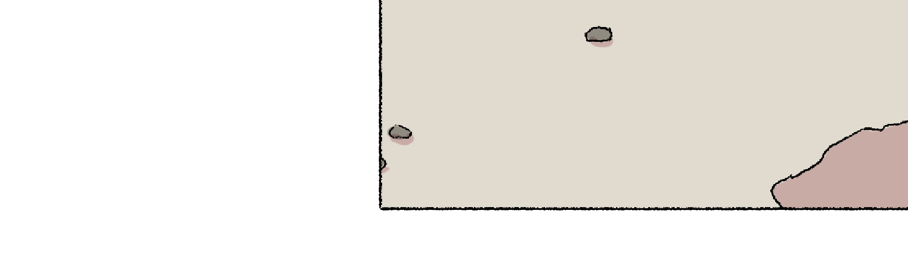
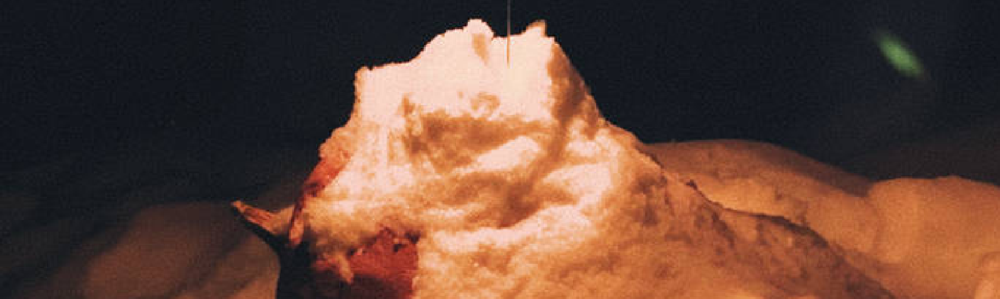
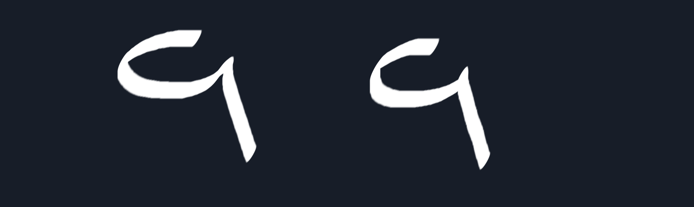

> This update is for [paying supporters](https://patreon.com/TodePond) of my work. 
> It's provided here, DRM-free :) 
> Please only read or listen if you've paid!

<input id="paid-checkbox" type="checkbox"><label for="paid-checkbox">Tick this box if you've paid!</label>

# TODEPOND PONDCAST: Don't do maths

<audio controls>
  <source src="1.m4a" type="audio/x-m4a">
</audio>

Ello. Welcome back to another weekly episode of the...

🐸 TODEPOND PONDCAST 🐸

What's new this week?

## Bot went missing

This week, [Flora Caulton](https://floracaulton.com/) made some concept art for an animation she's making for the next video, Top 99 Ways To Make Sand. And I love it.

If you didn't notice, I like to 'connect' consecutive videos together in some sort of way, so that there's at least a semblence of continuity.

- [Screens](https://youtu.be/Q4OIcwt8vcE) begins with the ending music of [New Cellular Automata](https://youtu.be/WMJ1H3Ai-qs).
- [Spellular](https://youtu.be/xvlsJ3FqNYU) begins with the ending infinite zoom of [Screens](https://youtu.be/Q4OIcwt8vcE).
- [Define](https://youtu.be/ZMklf0vUl18) begins with grayscale footage, which is the inverse of the rainbow at end of [Spellular](https://youtu.be/xvlsJ3FqNYU).
- [Arrows](https://youtu.be/DNBKdU6XrLY) begins with a "sorry to interrupt" from the previous video, [Define](https://youtu.be/ZMklf0vUl18).

Flora's animation will appear at the beginning of Top 99, as a way of connecting it to the end of [Arrows](https://youtu.be/DNBKdU6XrLY).

## Don't do maths

Most of the next video's music is part of an original score. ie: [Ivan Reese](https://ivanish.ca/) made it from scratch for this particular video.

However, I'm also using one of his existing tracks. He's now made me an updated version of that track, so that it fits better into the video, and to what I'm using it for. I love it!

We also discussed one of the other sections of the video, that doesn't have finalised music yet. I've blended together some of the different tracks to create a blend. There's a chance that Ivan might be able to do that blend himself, for a more seamless effect.

## Dream

In many of my recent videos, there's been a "dream" sequence towards the end of the video. The zoom out section in [Screens](https://youtu.be/Q4OIcwt8vcE), the dance section in [Arrows](https://youtu.be/DNBKdU6XrLY), the fractal section in [Define](https://youtu.be/ZMklf0vUl18), even the rainbow section of [Spellular](https://youtu.be/xvlsJ3FqNYU), and the real world section of [Tourism 2]. It's some section that goes a bit off-piste from the rest of the video. Some sort of right-angle twist. "Dream" is what I called those sections in my planning and notes.

> Fun fact: The Define dream was originally going to be at the very end, after the music section, but it didn't feel right.

The Top 99 video will also have a dream section. It feels like it's becoming more and more of a staple of the saga.

I've been planning and planning and re-planning this dream section, and I think I still have some work to do. I'm on draft version 3 right now, and I'm getting closer each time. There are still some 'blanks' in the storyboard leading up to the dream, which I'm trying to figure out. I need those parts there (I can't take them out) because the video now has a pacing that I like.

I think it's important to figure out the dream section first, before pressing on with the next phase of the process. Because it's what everything else leads into.

I do wonder sometimes, why do I put so much time and detail into just a few short minutes of a tech youtube video. I guess it doesn't matter.

**Thank you for enabling my unhealthy obsession with making weird youtube videos. This is all your fault. But yeah, really, thank you for your support, and welcome to all the new people this week. Wherever you are in the world, whatever you're doing, I hope you have a great week.**

_Days since tode fell asleep: 438_ 
_Days since bot went missing: 403_ 
_Days since berd flew away: 66_
