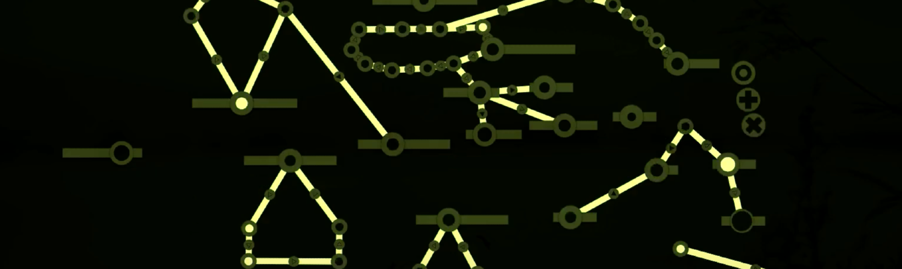
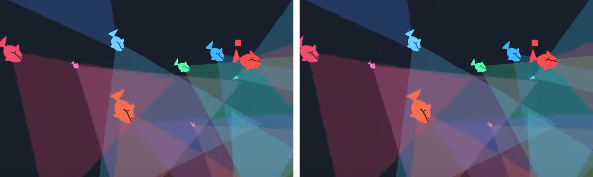
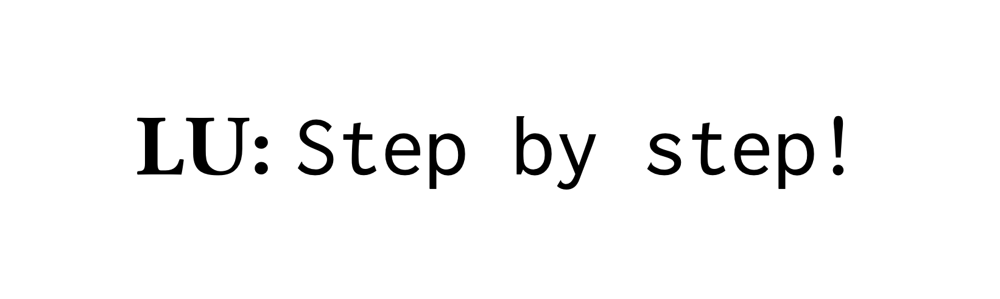
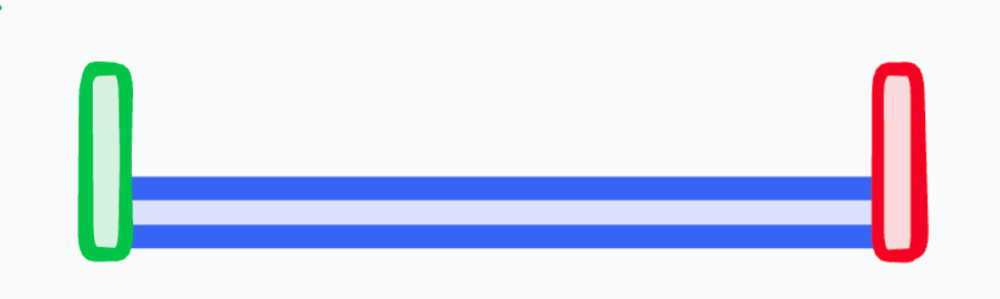
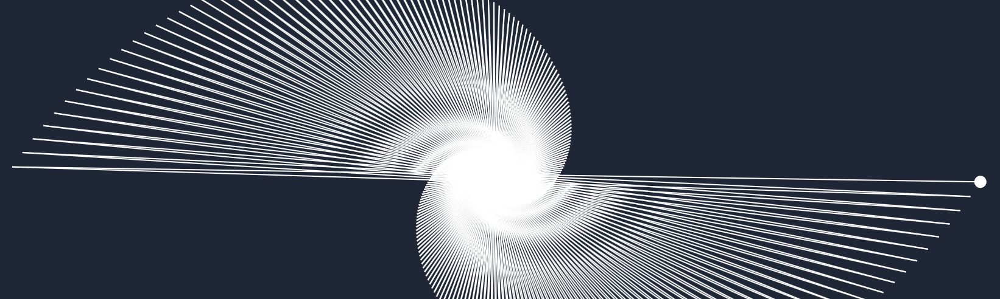

> This update is for [paying supporters](https://patreon.com/TodePond) of my work. 
> It's provided here, DRM-free :) 
> Please only read or listen if you've paid!

<input id="paid-checkbox" type="checkbox"><label for="paid-checkbox">Tick this box if you've paid!</label>

# TODEPOND PONDCAST: Elephant in the room

<audio controls>
  <source src="1.m4a" type="audio/x-m4a">
</audio>

Welcome back nerds. It's time for another weekly edition of the...

... oh no ... something isn't right. This pondcast is a week late. I missed one!

No, that's ok. I'll just do... two pondcasts in one week. That's fine. So here they are. I present to you... two pondcasts, one after the other. This first one is one I wrote down a week ago. It's another weekly edition of the...

🐸 TODEPOND PONDCAST 🐸

What's new this, I mean... What's new last week?

## Onward

This week (and weekend)... Last week (and weeekend), I spent all of my time (really, all of it) (I have no life) on my submission for [onward essays](https://2024.splashcon.org/track/splash-2024-Onward-Essays), that I'm writing with [Dave Ackley](https://www.cs.unm.edu/~ackley/). The deadline is on Thursday, so it's all go go go!

I did SO MUCH writing and editing over the weekend. I worked through the essay from start to finish, squashing out as many bad bits as I could. And I tried to tie it all together into a continual thread. This is a bit hard because the essay is in the format of some 'dialogues' that me and Dave had (for real). As in...

**DAVE:** Blah blah blah.

**LU:** Blah blah.

**DAVE:** Blah blah blah blah.

And so on.

I _am_ editing the dialogues a lot, but still - maybe the format's too weird to be considered for acceptance at the conference. I do hope they give it a chance, because I think it has finally started to pass the threshold of being 'good enough', moments before the deadline.

This happens with everything I make. It seems bad for so long. It's bad, bad, bad, bad, bad, bad, bad. And then - after working and working away at it for what seems like years - it finally switches over.

Bad, bad, bad, bad, bad, bad, bad, bad, bad, good, ship it!

There's still lots more work to do, and I'll have to see what edits Dave does, or asks for. I hope, I hope, I hope that we can get it done in time. But whatever happens, I hope this little essay can get a life of its own in some way, at some point. I've put a lot of heart into it (and also jokes - I guess that's ok?).

## Unlocking arroost

Oh no! More submissions incoming.

Last year, I went to a conference called [LIVE](https://liveprog.org/) to [demo cellpond](https://www.youtube.com/watch?v=eQgxFuw8f1U), and it was a great experience for me personally. This year, I'd like to try to do it again, but with [arroost](https://arroost.com).

So... I've been thinking hard about how to do that. I've already done two 'artistic' presentations of arroost - one on [youtube](https://youtu.be/DNBKdU6XrLY?si=ZPuBOWv-ldUZIZgp) and one in [person](https://youtu.be/cF2OF75ivZM?si=Dn0wDyje_Z0rTmha). But now I'm trying to present it in a more _academic setting_. There's a lot for me to say about it, and I think arroost warrants and deserves it. I did put a _lot_ of thought and time and research into it, and I'd love to share that work more widely - to gather feedback, and to `further my conspiracies`.

The angle I'd take is... Arroost's goal is to [creatively unblock](https://edibotopic.com/blog/doing/leisure-sick/) you when it comes to making music. It hopes to provide you with _emotional help_ in letting go of your inhibitions, and just _making something_.

I find this idea interesting, because I don't see it explored a lot as an angle towards creative tooling, such as drawing applications, writing tools, and programming environments.

Nonetheless, this idea _does_ build on top of a large body of work. It's just not the types of reference that usually appear at the [SPLASH](https://2024.splashcon.org/) conference. I'm gonna have to blend some fields together for this one.

## Elephant in the room

I was on (another) podcast. This time, it's another [FUTURE OF CODING](https://futureofcoding.org/episodes/) one. The episode is called [ELEPHANT IN THE ROOM](https://futureofcoding.org/episodes/071) because it's about a man called [Bret Victor](https://worrydream.com/), who is perhaps the most cited man within that community, but hasn't been explicitly covered by the podcast, at least in its current iteration.

It's very long, over three hours, but there _is_ a lot of fun weird stuff in it. For example, near the middle, there's a self-contained section in which I give a full art history lesson. I hope you enjoy it.

By the way, I've actually referenced Bret Victor in some of my previous work. I jokingly criticise him in [Define Define](https://youtu.be/ZMklf0vUl18?si=51LxQCPo6iNOfuGf) by saying that my fish are [dead](https://vimeo.com/64895205). And [arroost](https://github.com/TodePond/Arroost) deliberately goes against one of his recommended principles, in order to disprove it.

That being said, the reason Bret's work is worth criticising, is that it's so good. His approach, and presentation, continues to be a strong source of influence for me. So I'm pleased we were able to drag his name through the hours of stupid podcast!

And now... and now...

 

> This update is for [paying supporters](https://patreon.com/TodePond) of my work. 
> It's provided here, DRM-free :) 
> Please only read or listen if you've paid!

<input id="paid-checkbox-2" type="checkbox"><label for="paid-checkbox">Tick this box if you've paid!</label>

# TODEPOND PONDCAST: Step by step

It's time for _another_ weekly episode... of the...

🐸 TODEPOND PONDCAST 🐸

What's new this week?

## Step by step

We submitted our essay to [onward essays](https://2024.splashcon.org/track/splash-2024-Onward-Essays)! We made it! It's done! And I'm so relieved about that.

The final bits of work included rephrasing the ending, and making sure the thing was wrapped up nicely. For sure, the very start and the very end were the bits we rewrote the most times. Especially the start, to be honest! We kept finding more and more concepts that we needed to introduce and define - before getting into the heart of the essay. And we found more and more criticism that people might come up with. I wanted to get all the expected ones in there somewhere.

In some ways, I was the 'straight man' of the essay. [Dave](https://www.youtube.com/user/DaveAckley) was coming out with these wacky ideas, and I was the 'normal person' trying to make sense of them - rejecting them when needed, or helpfully misunderstanding stuff to allow us to explore things further. And this was true for the ending as well. Dave had already summarised the essay's argument in technical terms, so I wanted to try to rephrase it in a looser way, more generally speaking.

So... step by step, we finally completed the task. As I said, the essay is on a really weird topic, in a really weird format, so there's a chance they just reject us outright. But I still think it's worth transmitting in and of itself! Let's see what happens.

By the way, I wrote up my experiences of writing this essay in more detail [here](https://www.todepond.com/wikiblogarden/academia/natural-code/submitted/), in case you're interested in finding out more.

## Seet

Ok, back to my other projects! I took a look at the state that I left things, and I realised that I kind of abandoned my [Seet](https://www.todepond.com/wikiblogarden/see-it/prior-art/) project. I worked on it in early 2024, and made a bunch of demos and discussions and stuff. And then I just left it.

That was intentional! The project was a success in some ways, as it brought me closer towards some fully realised ideas. I think it showed me that there are 3 to 4 different directions I could take that work. And I hope to investigate them all in time.

But... I don't really have anything to show for my Seet work at this point. So I thought it would be good to do a detailed write-up: Of everything that I explored, discovered, tried, and decided. I've been working on that write-up this week! I don't want to spend toooooo much time on it, as it's already in the past, so I won't worry about getting it tooooooo high quality. I just want my thoughts _down there_, somewhere at least.

## Tadi labs

Tadi web! Tadi web.

[Tadi web](https://tadiweb.com) is an approach to programming that I've been working on for a while. I 'discovered' it while working on [arroost](https://arroost.com/), and it's inspired by a whole range of movements that aim towards [making computing better](https://www.todepond.com/wikiblogarden/better-computing/).

As an approach, the tadi web is quite unusual. It involves radical simplicity and minimalism, and the sometimes-difficult acceptance that most of my projects **die** at some point. "Instead of building software that tries to last forever, we should embrace the fact that software dies. How would our approach change if we take on this mindset?" ... which is known as the 'slippy mindset'.

This slippy mindset helped me to get arroost and the [arrows video](https://www.youtube.com/watch?v=DNBKdU6XrLY) finished! It also allowed me to build my new website, and tooling for paying supporters, and all sorts of stuff. I now use it in all my new projects, and it's going really well. It's allowing me to make things that I never could before.

The hard part, is that it's _such_ a different approach, that I feel like I'm having to learn everything all over again - from scratch. To help me with this, I've been building out loads of experimental mini-projects, tadi-style. I'm collecting them all together in a [lab](https://todepond.com/lab) website, and I hope that it becomes a growing collection of how to tadi web. At this point, I think I'm close to having enough mini-demos to 'present on stage'. When the next future of coding event happens, I might apply to present. Let's see! Let's see.

And ... let's get back to the video now.

**Now that the submission is done, I'm returning to work on the video. [Ivan](https://ivanish.ca/) and [Flora](https://floracaulton.com/) have both sent me more stuff for it, and I'm looking forward to getting it _in there_. So I thank you for your patience, and all your support. Thank you! And welcome to all the new people this past fortnight! I hope you enjoy your stay. For now, wherever you are, whatever you're doing, I hope you have a great week.**

_Days since tode fell asleep: 479_ 
_Days since bot went missing: 444_ 
_Days since berd flew away: 107_
