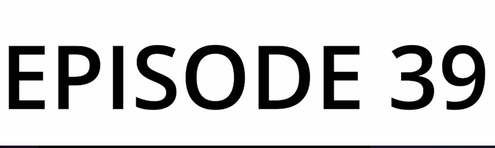
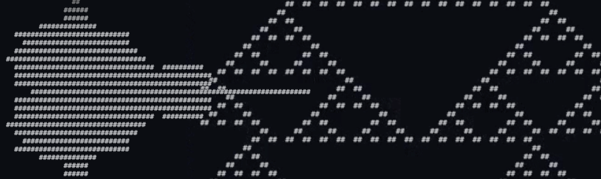

> This update is for [paying supporters](https://patreon.com/TodePond) of my work. 
> It's provided here, DRM-free :) 
> Please only read or listen if you've paid!

<input id="paid-checkbox" type="checkbox"><label for="paid-checkbox">Tick this box if you've paid!</label>

# TODEPOND PONDCAST: Final shot

<audio controls>
  <source src="1.m4a" type="audio/x-m4a">
</audio>

Welcome back to another weekly episode of the...

Apologies. I'm a bit unwell, so I'm saving my voice. And I'm getting the computer to read out this week's episode of the...

🐸 TODEPOND PONDCAST 🐸

What's new this week?

## Part one: Final shot

[Last week](https://www.todepond.com/pondcast/vision-pro/), I told you that [Ivan Reese](https://ivanish.ca/) agreed to make the music for my next video, Top 99 Ways To Make Sand.

I needed to give him some information about the video, so that he'd know what sort of thing to make. I spoiled the ending of the [Arrows](https://www.youtube.com/watch?v=DNBKdU6XrLY) video for him. Then I spoiled the ending of the Top 99 video too. And I told him about the general themes and messages and feelings of them.

I blocked out the structure of the video. And I made a storyboard of the entire intro, the entire 'middle bit'. And I didn't storyboard the ending, but I did tell Ivan what the final shot will be.

And then he made some music.

## Part two: Animatic

I took Ivan's music, and I placed it onto the video timeline. I transferred my storyboard to it too. And I marked out the whole thing, all the different parts of the video, and timed them to the music.

_Dividing up all 99 of the sands took a long time, but I did it._

However... there was something wrong with the structure of the video. Each individual track of music was used for just one individual section. Track 1 was used for Section 1. Track 2 for Section 2. And so on.

But the transitions between sections weren't smooth enough. The video stopped. Then the video started. And it was a bit jarring.

So I restructured the video so that each track of music _overlaps_ and blends between sections. Track 1 goes through Section 1 and Section 2. Track 2 goes through Section 2 and Section 3.

## Part three: Dreamberd interpreter

I have a silly little joke language called [Dreamberd](https://github.com/TodePond/DreamBerd). It's not a real language. It's made up.

Most of Dreamberd's features are ridiculous, and borderline impossible to implement. But that hasn't stopped people trying to build it for real. No one has been able to do it. Until now...

A highschool student called [Vivaan Singhvi](https://vivaansinghvi07.github.io/) has now created the world's first mostly-functional [Dreamberd interpreter](https://github.com/vivaansinghvi07/dreamberd-interpreter). As promised, I've donated £99 to his charity of choice, [Second Harvest Food Bank](https://secondharvestetn.org/).

**I can't express to you how much joy it brings me when someone builds a project inspired by one of mine. So I thank you from the bottom of my heart for building and supporting this community. Wherever you are in the world... whatever you're doing... I hope you have... a great week.**

Goodbye.

_Days since tode fell asleep: 417_ 
_Days since bot went missing: 382_ 
_Days since berd flew away: 45_
