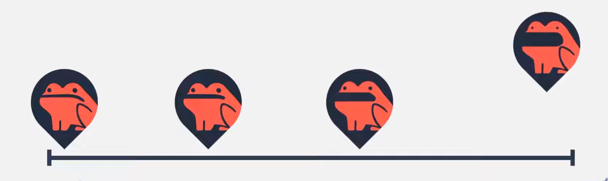
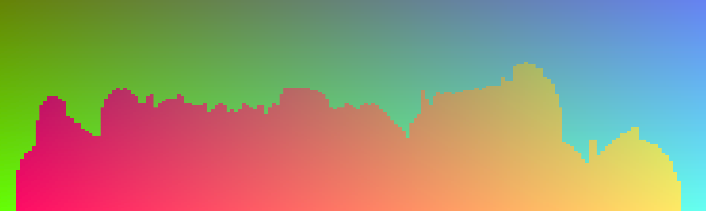

> This update is for [paying supporters](https://patreon.com/TodePond) of my work. 
> It's provided here, DRM-free :) 
> Please only read or listen if you've paid!

<input id="paid-checkbox" type="checkbox"><label for="paid-checkbox">Tick this box if you've paid!</label>

# TODEPOND PONDCAST: Finding ninety nine sands

<audio controls>
  <source src="1.m4a" type="audio/x-m4a">
</audio>

# TODEPOND PONDCAST: Finding ninety nine sands

Welcome one, welcome all. To another weekly episode of the...

🐸 TODEPOND PONDCAST 🐸

What's new this week?

## Top 100

"Top 100" is a popular video format on youtube.

- [Top 100 Ways To Walk](https://www.youtube.com/watch?v=HEoUhlesN9E)
- [Top 100 Ways To Die In Garry's Mod](https://www.youtube.com/watch?v=NLijSNnLG4Y)
- [Top 100 3D Renders](https://www.youtube.com/watch?v=iKBs9l8jS6Q)

The format continues to develop as youtubers push it further and further, finding its limits. One of my favourites is Tom7's video about his [Top 30 Weird Chess Algorithms](https://www.youtube.com/watch?v=DpXy041BIlA).

I love this kind of video. There's something so satisfying about a long list. It feels like unwrapping presents. You don't know what the next one's gonna be! And there's a sense of wonder in thinking "how are there so many!?"

## Nine

Top 100 videos often start out strong. Every number of the countdown brings something fresh and unique. They stand on their own two feet. Each entry is a new idea!

But as the video goes on, the ideas can start to get weaker. As you run out of ideas, you end up re-using some multiple times, and they start to lose their impact.

Imagine I made a [Top 10 Ways To Make Sand](https://www.youtube.com/watch?v=BDyvjkAs5-Y) video. It would be a bit disappointing if some of those 10 sands were basically copies of each other. If one was "sand that falls to the left" it would be disappointing if one was "sand that falls to the right". They'd be one 'group' of sands.

And hey, this is what happened! I made a [Top 10 Sands](https://www.youtube.com/watch?v=BDyvjkAs5-Y) video and two of my sands were basically copies of each other. They were in a group.

So I decided to cut one sand out! And the video became [Top 9 Sands](https://www.youtube.com/watch?v=BDyvjkAs5-Y) and here we are over three years later, and the number Nine has become a recurring in-joke in the [Sandpond Saga](https://www.youtube.com/playlist?list=PL9uRa69RF-7ySCA9p13KOvzWjOOrxe46o).

## Top 99

This week, I've been working on the next video, Top 99 Ways To Make Sand. And I have a rule!

NO GROUPS.
NO COPIES.

Every sand must be unique, and not an 'echo' of something else.

I've got a lot of unique sands. Now I'm putting them in order.

**There's a method to the madness! Thank you for supporting me with it all. I can't thank you enough. I really mean that!**

 

Appearances this week:

- [Future of coding: Beyond efficiency](https://futureofcoding.org/episodes/070)
- [Scaling devtools: Show the whole process](https://www.youtube.com/watch?v=yVAGf1zVde8)
- [AI is bad/good actually](https://www.todepond.com/wikiblogarden/better-computing/worse-computing/artificial-intelligence/bad/good/)
- [Put academia in the bin](https://www.todepond.com/wikiblogarden/academia/from/the-outside/)

 

_Days since tode fell asleep: 424_ 
_Days since bot went missing: 389_ 
_Days since berd flew away: 52_
