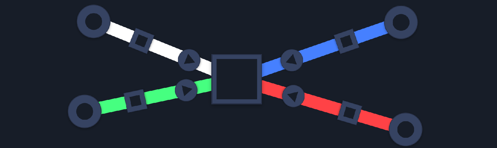

> This update is for [paying supporters](https://patreon.com/TodePond) of my work. 
> It's provided here, DRM-free :) 
> Please only read or listen if you've paid!

<input id="paid-checkbox" type="checkbox"><label for="paid-checkbox">Tick this box if you've paid!</label>

# TODEPOND PONDCAST: Infinity rooms

<audio controls>
  <source src="1.m4a" type="audio/x-m4a">
</audio>

Welcome back... to another weekly episode... of the...

🐸 **TODEPOND PONDCAST** 🐸

What's new this week?

## Pixel

I added a new thing to Arroost. It's a square shape. And it's for **storing** information.

Arroost is a machine that ticks forwards at a speed of 120 beats-per-minute. Whenever it does this, all 'pulses' in the machine end.

A pulse only lasts one beat.

But there's now an exception. If a pulse is in a square, it stays around.

You could use it to keep hold of something, for later use. Or use it as an indicator. A little light to show if something is on or off. Or combine different squares together as pixels, to make a screen. Show something on the display! Make pink sand! (Warning: very tricky)

## Infinity

This week, I've been working on Arroost's final feature (at least, its final feature needed for the upcoming video).

You need to be zoom in and out freely. You need to be able to zoom **inside** cells. That's why they all have a 'gap' in their middle.

I finetuned my secret 'smooth-camera' mode that I often use for longer shots. You may have seen it in previous videos like [Screens](https://www.youtube.com/watch?v=Q4OIcwt8vcE), [Cells](https://www.youtube.com/watch?v=gv40Z9tVjAI) and [Spells](https://www.youtube.com/watch?v=xvlsJ3FqNYU).

And the camera now 'teleports' you to a different place when you zoom past a certain threshold. For testing purposes, it currently just teleports you back into the same 'world' that you're currently in. It feels like falling down an infinite tunnel. I know that's a bit cryptic but it's getting to the point where I don't want to spoil too much.

## Interview

This week, I got interviewed at an internal event at [Ink & Switch]. There were quite a few people watching!

I got asked about how I got started, how I think about my projects, how I go about making them. It was very fun! But slightly odd talking about myself for so long.

Sometimes, when I speak about my approach out loud, I hear how ridiculous they sound. Why do I spend so much time on a nine minute video? Why do I leave things so unexplained? Why do I try to reduce my audience? Why do I make the music too loud? Why do I write and speak these updates every single week??

**Either way, thank you for supporting me and my work! Welcome to all the new people that joined this week! And welcome back to all the old-timers. Wherever you are, I hope you have a Great week.** 🐸

Days since tode fell asleep: 339 
Days since bot went missing: 304
