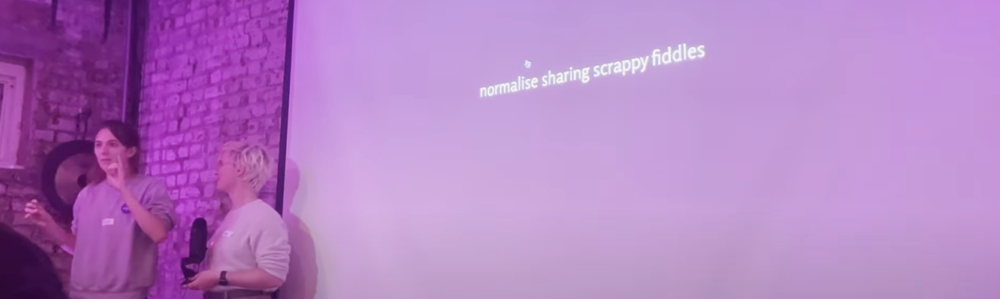
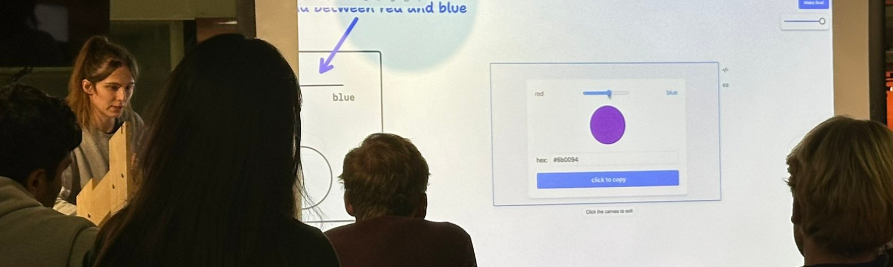

> This update is for [paying supporters](https://patreon.com/TodePond) of my work. 
> It's provided here, DRM-free :) 
> Please only read or listen if you've paid!

# TODEPOND PONDCAST: Multiple angles

<audio controls>
  <source src="1.m4a" type="audio/x-m4a">
</audio>

Hello again. It's time for the weekly...

🐸 TODEPOND PONDCAST 🐸

What's new this week?

## Multiple angles

I did a talk last week! Luckily, lots of people filmed it, and they sent me their recordings. I edited together all of the different angles.

**Go watch the full version [here](https://www.youtube.com/watch?v=cF2OF75ivZM&list=PL9uRa69RF-7wtC26i-yAJ-OiXzSwnFmUt&index=1).**

I tried to play around with the editing a little bit. I hope you enjoy it.

Of course, thank you to everyone who filmed and/or *performed* in the show.

## Automatic

I've been.. you guessed it.. continuing work on Arroost!

This week, I've been adding the ability to make stuff happen *automatically*. What I mean by this is....

Well, ok. First you need to understand that there are certain **tools** in Arroost. For example, there's a tool for creating, a tool for destroying, a tool for connecting, and more.

These tools don't live in a toolbar, or a part of the user interface. They live in the **world of arroost** itself. They're **things** that you can move around, and interact with.

These means that the tools also work on themselves. You can create them, destroy them, and connect them. You can wire them up!

You can construct a 'program' where different tools point to (or through) other tools. They can do more complex and specific things, like:

- record a sound that's 2-beats long.
- play the sound three times.
- reset the sound.

But it's not [turing-complete](https://www.youtube.com/watch?v=cBYudbaqHAk&t=6704s). Maybe one day.

## Text

I've started to make more complicated things with Arroost. So much so, that I often get confused about what my constructions do.

> *"Wait, what did this button do again?"*

I keep forgetting what each part of my machine does!

So I've added a new tool: A text tool. It creates a label that you can type *letter* and *words* onto. This helps you to organise your machine a bit better!

## Appearances

I recorded another podcast episode this week. Another recording is lined up for next week. And I've been arranging to be a guest on a *different* podcast.

My [old talk](https://www.youtube.com/watch?v=cBYudbaqHAk&t=6704s) was mentioned in the new Ink & Switch [newsletter](https://www.inkandswitch.com/newsletter/dispatch-001/). And I'm scheduled to do an internal workshop there in December.

Two of my [blog](https://www.todepond.com/wikiblogarden/better-computing/worse-computing/minification/) [posts](https://www.todepond.com/wikiblogarden/social-media/analytics/) appeared on the front page of hackernews (a vile website).

I did a talk yesterday about my work at [tldraw](https://tldraw.com) and I'm doing another one tomorrow. I'm doing another one in two weeks. And some more are getting booked in, from people who saw me do it yesterday.

**It's all go, for better and worse. So... thank you for all your help with it. Your support helps me to continue my projects despite everything! I truly mean this when I say: Wherever you are in the world this week, I hope you have a good one.**

*Days since tode fell asleep: 328* 
*Days since bot went missing: 293*

