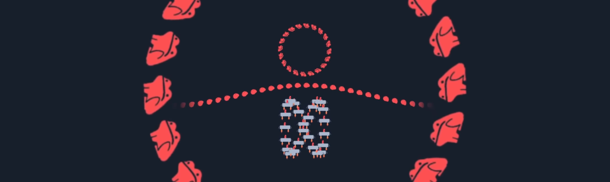
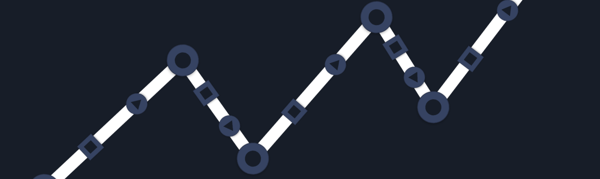

# Hey, this pondcast is scheduled to come out during [CSS Naked Day](https://css-naked-day.github.io/)! So it might look really different to usual haha

> This update is for [paying supporters](https://patreon.com/TodePond) of my work. 
> It's provided here, DRM-free :) 
> Please only read or listen if you've paid!

<input id="paid-checkbox" type="checkbox"><label for="paid-checkbox">Tick this box if you've paid!</label>

# TODEPOND PONDCAST: Natural code

<audio controls>
  <source src="1.m4a" type="audio/x-m4a">
</audio>

Hello hello welcome back everyone. It's time for the...

🐸 TODEPOND PONDCAST 🐸

What's new this week?

## Natural code

Work continues on the essay that I'm writing with [Dave Ackley](https://www.cs.unm.edu/~ackley/)! We've been having many more chats and recorded 'dialogues'. It's about the idea of `natural code`.

Basically... um... and this might sound a bit odd... but it's this idea that we can see all communication as a form of `code`, similar to computer code in some ways. And in fact... it's useful for us to do that... therefore, we should!

_It might sound cold, or robotic, to think about people in this way, but it's not (I promise)._

It has been very interesting for me to learn more about this way of thinking. I feel like I've learned new things about `computer code`, as well as `natural code`. That is to say... I've learned about both people and computers, all machines of some sort.

This person-computer comparison is something that feels at-home in Sandpond Saga extended universe.

## Overflow

<!--  -->

I've continued to work on the next video, Top 99 Ways To Make Sand. This week, I added a new piece of music to the middle section. Again, it's a track by [Ivan Reese](https://ivanish.ca/).

I really like how this track has landed in. It's starkly different to the two tracks that it's sandwiched between, which gives that section an identity of its own.

By that point in the video, I hope that the viewer feels like they're being taken all over the place. I hope that they can sit back and surrender to the places that the video takes them.

At this point, all of the different scenes of the video are now decided. That middle section was the final part to figure out.

The scenes are as follows:

- Appetiser
- Intro
- Title
- Climb
- Confession
- Takeoff
- Fall
- Overflow
- Rewind
- Break
- Dream
- Credits
- Teaser

## Normalise sharing scrappy fiddles

<!--  -->

I think I've recovered from [Arroost](https://www.youtube.com/watch?v=DNBKdU6XrLY) now. I think I can finally start to do retrospectives on it.

I've been thinking about how to present Arroost in a more serious way — in a more academic setting. And I'd like to hone in on the idea of `normalising sharing scrappy fiddles`.

`Normalise sharing scrappy fiddles` is my stupid way of saying that we should encourage people to be comfortable and happy with their half-baked creations. When you're being creative... When you're creating a thing... It's crap for a long time... It's very scrappy...

And when you're creation is scrappy, you might not feel proud of it. You might feel ashamed of it. You might want to hide it. And I think this feeling of shame is bad for the creative process. And I made Arroost to explore this idea.

I wanted Arroost to be really hard to use, so that you feel free to create, without any shame. And I think the project succeeded! My favourite proof of that is [this blog post](https://edibotopic.com/blog/doing/leisure-sick/) by Shane Crowley, where he shares his own experience in using Arroost.

I've convinced myself. Now I need to convince everyone else. Or, at the very least, some academic reviewers.

**Thank you so so much for supporting me and my projects. My current projects might seem to be in a loose and scrappy state, because they are. But those of you who have been here a while will know that it does _eventually_ turn into a finished thing. I can only do that because of your help. So Thank you Thank you! And wherever you are in the world... Whatever you're doing... I hope you have a great week.**

_Days since tode fell asleep: 459_ 
_Days since bot went missing: 424_ 
_Days since berd flew away: 87_
