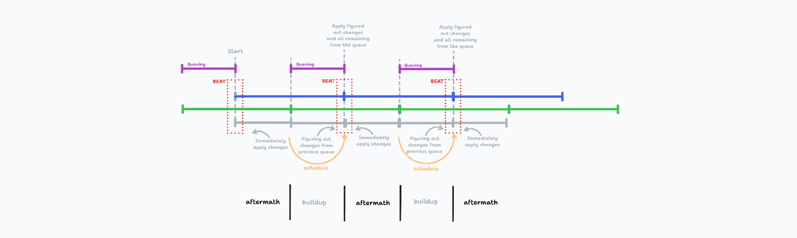
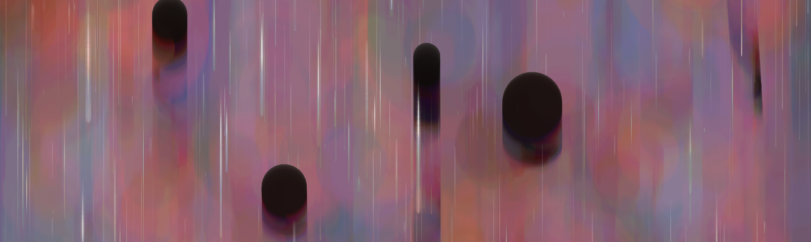
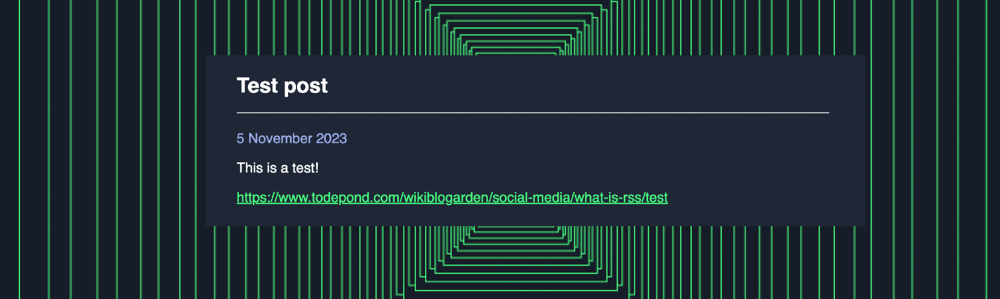
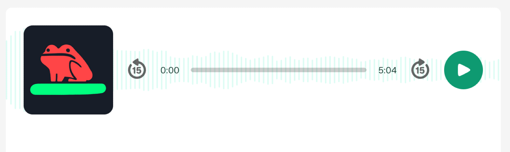
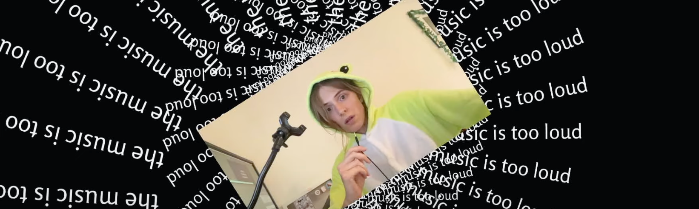

> This update is for [paying supporters](https://patreon.com/TodePond) of my work. 
> It's provided here, DRM-free :) 
> Please only read or listen if you've paid!

# TODEPOND PONDCAST: Perfect rhyme

<audio controls>
  <source src="1.m4a" type="audio/x-m4a">
</audio>

Would you look at the time. It's time for the weekly...

Wait. before we start, this might be a long one. Please, grab a tea, or coffee. Make yourself at home, at the...

🐸 **TODEPOND PONDCAST** 🐸

What's new this week?

## Perfect rhyme

I've been sharing [arroost](https://arroost.com) with people (online and in-person), and getting them to try it out.

Through that, I've discovered various bugs and issues. Which I've now fixed! 🌈🙌

I've also seen how people *get on with it*. And their *reactions* to it.

The majority of feedback has been positive. I'm pleased to hear that it feels like a strange and novel experience to some. And I've been delighted to see the *scrappy fiddles* they make with it.

There has been another set of reactions to it. For one reason or another, it gets some people *typing*, and not necessarily in a nice way. I'm not entirely sure why this is! But I was hoping that arroost would be provocative, so I'm pleased. I just didn't expect it to happen so soon.

## Perfect time

This week, I've upgraded the *timing* that powers the arroost engine.

Previously, I kept time manually. I did it myself - I just counted how many milliseconds passed, and when there were enough, I triggered the next 'beat' of the music.

**This did a terrible job of staying in time.**

On the one hand, this sloppy timing contributed to some of arroost's fun 'looseness'. But on the other hand, It's loose enough as it is, with everything else going on.

So I replaced my scrappy solution with an existing good one. I already used [Tonejs](https://tonejs.github.io/) to record and play sounds. Now I keep time with it too.

## Buildup and aftermath

120 times a minute (the [sacred BPM](https://elk.zone/mas.to/@yaxu@post.lurk.org/111369314609629635)), arroost advances the world through time. When it does this, it has to check and update every single cell. This can take a long time.

> If I coded it better, it wouldn't take so long. But I [didn't](https://github.com/TodePond/Arroost/issues/158), so here we are.

The problem is: Arroost leaves everything to the last millisecond. It knows that a beat is coming up, but it just sits there, doing nothing.

> Arroost is a procrastinator.

Instead, it should start working things out ahead of time, so that everything's ready when the beat **hits**.

I've now separated out some of its work over the course of the 'gap between beats'. It isn't fully done, and it still stutters when it struggles to keep up. But those stutters are now smaller and more spread out.

## Autoconnect

Also this week, I improved the interaction for 'connecting cells together' in arroost.

Previously, you had to:

Step 1. Create a cell.
Step 2. Create another cell.
Step 3. Connect them together.

It took an annoyingly long time! And if you 'missed' the cell while connecting (by accidentally clicking on the background)... it canceled the connection. You had to do it all over again.

Now, you can just connect 'empty space' by trying to connect 'nothing'. It'll make a cell for you, automatically. It feels less clunky, and a bit more malleable. 

Step 1. Connect.

That's it. It's auto-connect.

## Yes music

This week, I've also been preparing the video *after* the next one.

I've been speaking with [Ivan Reese](https://ivanish.ca/) about it, and he's probably going to make some music for me.

That's why I need to work on it so early - to give him time to make stuff. Ivan, if you're listening to this (and I know you are), then I'll send the storyboard to you soon.

## Dripfeed

I also set up [a feed](https://www.todepond.com/feed/), in case you want to follow along with my blog/wiki/garden/memex/whatever.

## Aftermath

Lots of people have been contacting me about the [talk](https://www.youtube.com/watch?v=cBYudbaqHAk&t=6704s) I did recently, which is really nice!

My [email inbox](mailto:todepond@gmail.com) is quite full at the moment, but I'm gradually getting through everyone.

## Trustware

Numerous paying supporters have been having trouble accessing these weekly updates, for various reasons.

I want these to be easy to read and access. Because of that, I'm experimenting with sharing them on [my own website](https://todepond.com) too.

They're still only for paying supporters, but you don't need to sign in or anything.

The only way I'm enforcing it is through *trust*. There's a message at the top of the screen explaining that it's just for people who pay.

> If you're listening or reading without being a paying supporter... Shoo! Get outta here!
>
> No, I'm just kidding, please just [pay me money](https://patreon.com/TodePond). This stuff takes a lot of work.

## 2023

Realistically, I'm aiming to get the arroost video out by the end of the year (even if that means December the 40th). Thank you for your patience.

There are many reasons why it's taking too long. When it comes out, I'll release a whole retrospective of "WHY ARROWS IN ARROWS IN ARROWS TOOK SO LONG".

I also plan to do a livestream event for the eventual release. More info to come, potentially very last-minute.

## 2024

I was also a guest on a podcast this week! I think the episode will get released in 2024.

(I'll let you know).

---

There's a lot going on. From the bottom of my heart, thank you for funding it all, and supporting my projects. And welcome to all the new people this week! You've joined a dedicated group of heroes. Until next time... I hope you have a great week 🐸

_Days since tode fell asleep: 308_ 
_Days since bot went missing: 273_
