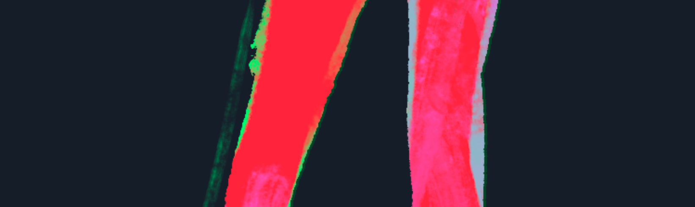
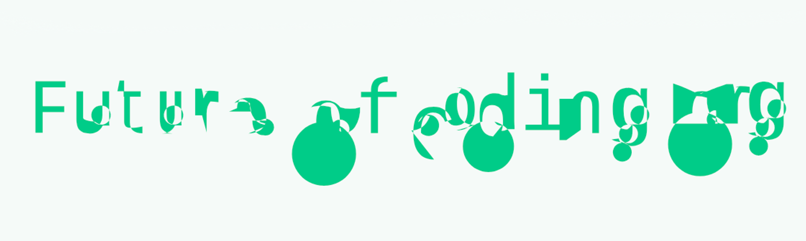

> This update is for [paying supporters](https://patreon.com/TodePond) of my work. 
> It's provided here, DRM-free :) 
> Please only read or listen if you've paid!

<input id="paid-checkbox" type="checkbox"><label for="paid-checkbox">Tick this box if you've paid!</label>

# TODEPOND PONDCAST: Puss in boots

<audio controls>
  <source src="1.m4a" type="audio/x-m4a">
</audio>

Welcome back to another weekly episode of the...

> _Wait. Before we get started, make sure you claim your spot in the Pond of Fame for the upcoming video. There are instructions in the last post. If you've entered your email, and you haven't got your secret code yet, then feel free to email me! todepond@gmail.com_

Now it's really time for the...

🐸 TODEPOND PONDCAST 🐸

What's new this week?

## Berd

I've been working on the upcoming video! Or rather... [Flora Caulton](https://floracaulton.com) has been working on the upcoming video.

She's been animating berd in a way that's unlike anything else in the series so far. I really like how it has turned out, and I'm excited to share more about it - after the video comes out.

## Seamless

I've been working on the 'infinite zoom' sequence of the video. I've been getting it to blend seamlessly between different 'layers' of the Arroost engine.

The problem is that there's sometimes a visible 'pop' as you go from one layer to the next. If your aim is slightly off, it feels like you're moving 'through' something. But it _should_ feel like you're moving 'into' or 'out of' something.

I've been trying out a few different approaches. I tried adding a blur effect, like I did in the [Screens](https://www.youtube.com/watch?v=Q4OIcwt8vcE) video's infinite zoom. And I tried gradually changing the opacity of what you're zooming into. Both of these help. But if I use them too much, it starts to ruin the illusion, because it makes it too obvious how I'm doing it.

A simpler solution was to just increase the 'fractal distance' between the different layers. You have to zoom in-and-out FURTHER to move between them. This way, it's easier to aim, and there's less chance of going 'through' something.

## Puss in boots

News: I'm now a co-host of the [Future of Coding](https://futureofcoding.org/) podcast! And I'm present in the [most recent episode](https://futureofcoding.org/episodes/069).

In the podcast, the three of us revisit classic papers about coding... and we try to understand them. Sometimes we succeed, and sometimes we fail. But hopefully they can help us build the FUTURE OF CODING. The FUTURE OF CODE. The FUTURE OF CO-DING.

The three of us (me, Ivan, and Jimmy) all have different backgrounds and opinions, so we often disagree. There's a nice balance going on. Jimmy is the philosopher. Ivan is the artist. And I am the...

Jimmy is the only one of us who actually likes papers. Ivan is the only one of us who actually likes podcasts. And I am the...

Jimmy is jolly. Ivan is jaded. And I am...

Jimmy is Donkey. Ivan is Shrek. And I am Puss-In-Boots.

**Thank you again for supporting my work, and sticking around. And welcome to all the new people this week! Wherever you are in the world... whatever you're doing... I hope you have a great week.**

_Days since tode fell asleep: 360_ 
_Days since bot went missing: 325_
