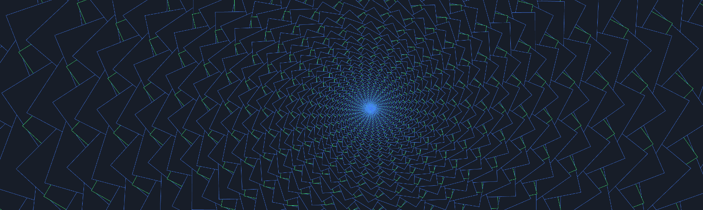
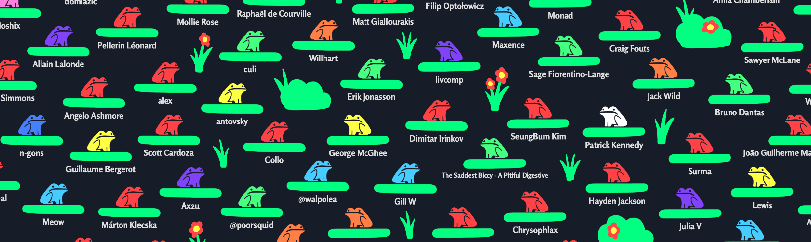
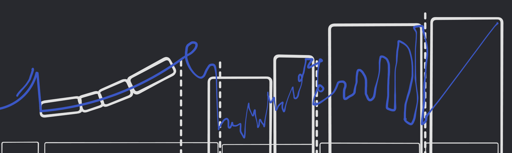

> This update is for [paying supporters](https://patreon.com/TodePond) of my work. 
> It's provided here, DRM-free :) 
> Please only read or listen if you've paid!

<input id="paid-checkbox" type="checkbox"><label for="paid-checkbox">Tick this box if you've paid!</label>

# TODEPOND PONDCAST: Replacement

<audio controls>
  <source src="1.m4a" type="audio/x-m4a">
</audio>

Can you hear me ok? It's time for another weekly episode of the...

🐸 TODEPOND PONDCAST 🐸

What's new this week?

## Replacement

This week, I've been working on Arroost (for the next video). I've been putting more in place for one of the ending sequences of the video: An infinite zoom sequence.

Zooming in forever is a bit hard. When your 'zoom level' gets too high, your computer struggles to deal with how large the numbers get. It gets inaccurate, and everything starts shaking around.

[tldraw](https://tldraw.com) gets around this by limiting your camera. You can only zoom in to 800% zoom. It doesn't let you go any further. For most use-cases, this is fine.

In [screenpond](https://www.youtube.com/watch?v=Q4OIcwt8vcE), I got around this by seamlessly swapping out the world with a similar-looking world. A world that's slightly more zoomed out, but looks the same from your current position.

If you do this early enough, the two worlds are similar enough that you don't notice any inaccuracies. And the same approach works in arroost too!

It's a bit like falling down an infinite set of portals in [Portal](https://www.youtube.com/watch?v=BePtsISQQpk).

## Pond of fame

At the end of every video, I show all of my patrons and paying supporters in the credits. (That's you! Yes, I'm talking about you! You in particular!)

I used to manually add each new patron to the 'pond of fame'. But the number of people joining is now too many for me to deal with on my own. It's a nice problem to have!

I've been building an automated system that lets you choose your own name and colour. I need to get it finished in time for the next video.

## Order

I've also been doing more preparation work for the following video. I've been drawing up different parts of the storyboard, and going through the pacing of the video with [Ivan Reese](https://ivanish.ca/), who's making some music for me

In the storyboard, I've laid out the 'key moments' of the video in quite close detail. For the parts between them, I've just left blanks.

"Insert 99 sands here" is in one place. I do have plans written out for them, but they don't need storyboarding (yet).

**Thank you for your continued support and patience! I hope you feel pleased to be helping out these weird tech/art projects. I can't wait to show you more and... Wherever you are in the world... Whatever you're doing... I hope you have a great week.**

_Days since tode fell asleep: 346_ 
_Days since bot went missing: 311_
