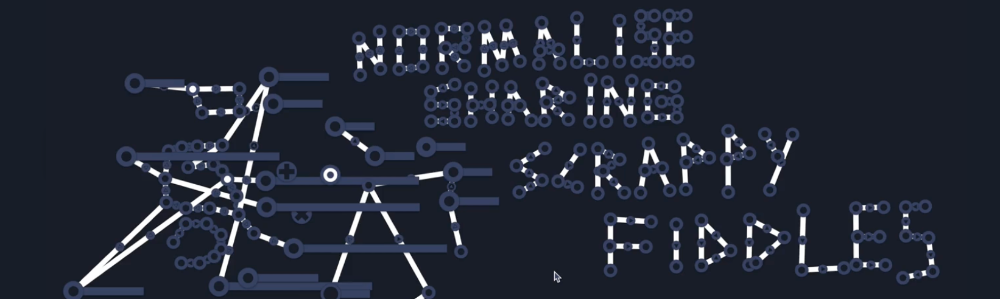
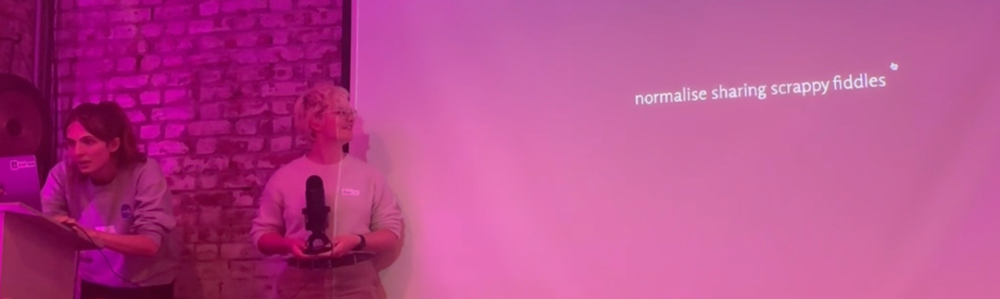

> This update is for [paying supporters](https://patreon.com/TodePond) only. 
> It's provided here, DRM-free :) 
> I trust you to only read or listen if you've paid!

# TODEPOND PONDCAST: Set

<audio controls>
  <source src="1.m4a" type="audio/x-m4a">
</audio>

Welcome back to the weekly...

🐸 TODEPOND PONDCAST 🐸

What's new this week?

## Noise

In [Arroost](https://arroost.com), you can record sounds.

Previously, there wasn't any indication of how long a sound was. But now, there is! A line grows when you're recording. The longer you record, the longer the line gets.

The line _is_ the sound. And you can CLICK and interact with it. You can slide it further to the right to make it start playing later. You can slide it to the left to make it start earlier. Or at least... for now it just trims off the start - as if it had started earlier.

I'm going to add more ways of manipulating with it, like trimming either end.

## Focus

[Arroost](https://arroost.com) makes a lot of noise.

When I use Arroost, I usually have headphones on. I don't play it out of my speakers because then it gets too noisy. And then my microphone picks up the sound.

This means that the same sounds get recorded again and again and again. It makes a feedback loop, and it just because A LOT OF NOISE.

So I added a "focus mode". Press [F] to enter focus mode. It's not very discoverable, and impossible on touch screens, but I'm just testing it out.

It makes everything mute while you're recording new sounds. It was especially important for..........

## Set

I presented Arroost at the [Future of Ding](https://futureofcoding.org/) event here in [London](https://lu.ma/foclondon). First, I showed the basics of how it works. Then, I showed some [examples](https://www.todepond.com/wikiblogarden/arroost/examples/) of how it works. Then, I got 5 audience members up on stage, and we recorded a song together.

It was definitely the weirdest talk I've ever done. I feel like I needed to cure myself after doing the [most normal talk I've ever done](https://www.youtube.com/watch?v=cBYudbaqHAk&t=6704s) a few weeks ago (still pretty weird).

It was very inspired by the [nonsense machine](https://www.youtube.com/watch?v=vX-dEq4UDYI) performances of [Maywa Denki] and also [some clowns I met once](https://youtube.com/shorts/oPyjUOqBo0g).

It was a massive experiment. But I'm pleased with how it went! It gave me a lot to think about in terms of what's possible to do with a "tech talk".

I have a bunch of recordings of it, and I'll put it up soon. Meanwhile, work on Arroost, and the next video... continues.

**So, thank you for all your support. I can't express quite how thankful I am. And welcome to all the new people this week! Wherever you are in the world... whatever you're doing... I hope you have a good week.**

_Days since tode fell asleep: 318_ 
_Days since bot went missing: 283_
