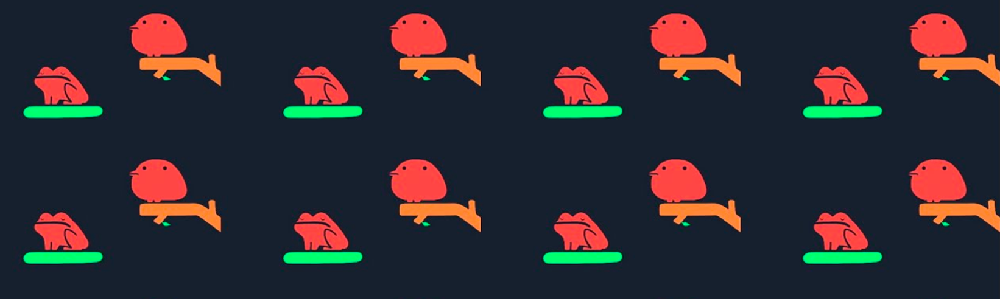
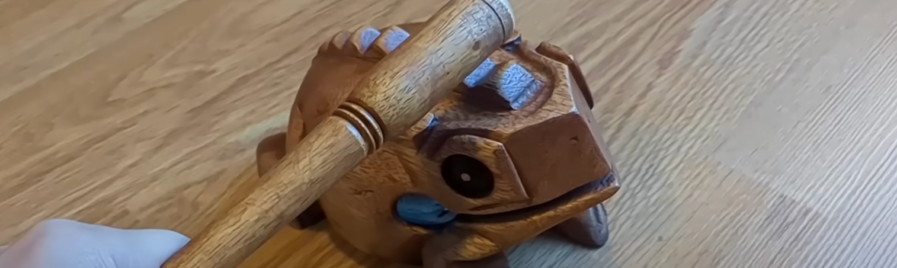

> This update is for [paying supporters](https://patreon.com/TodePond) of my work. 
> It's provided here, DRM-free :) 
> Please only read or listen if you've paid!

<input id="paid-checkbox" type="checkbox"><label for="paid-checkbox">Tick this box if you've paid!</label>

# TODEPOND PONDCAST: Sixteen scrappy fiddles

<audio controls>
  <source src="1.m4a" type="audio/x-m4a">
</audio>

Hello and welcome back to another weekly edition of the...

🐸 TODEPOND PONDCAST 🐸

What's new this week?

## Sixteen scrappy fiddles

Whenever I'm making a video, I repeatedly export what I've got so far. It's partly to make another form of backup. And it's partly so that I can rewatch it again and again. To make notes on any changes I want to make.

I end up with loads of exported videos. They're all different. They show a little snapshot of that point in the video-making process.

I thought it would be interesting to put a lot of these side-by-side from the recent [Arrows](https://www.youtube.com/watch?v=DNBKdU6XrLY) video. So I did that, with sixteen of them. You can watch those sixteen work-in-progresses [here](https://youtu.be/s1Y-1Ok6r7Y).

I did this once before as well, for the [Screens](https://www.youtube.com/watch?v=Q4OIcwt8vcE) video. Check it out [here](https://youtu.be/EYFXXzlDnTc) if you're interested.

## Yes music

As you may have noticed, I made a lot of music for the [Arrows](https://www.youtube.com/watch?v=DNBKdU6XrLY) video. I found it very tricky.

I had in mind the tone that I wanted to create. I wanted a slightly understated melancholy, with a bit of hope. I wanted to embrace the frustration and enjoyment of being stuck on one project for a long time. And I played around on various instruments to try to get that.

I had some other constraints too. I needed it be very simple, so that I could realistically build it in [Arroost](https://arroost.com/). And I wanted it to have a load of variations - so that I could keep coming back to some of the same tunes. I wanted some of them to be a bit catchy.

I hope to give a more breakdown of those tunes over the coming weeks. Stay tuned. (haha tuned)

## Year of chaos

As you may have seen [last week](https://www.todepond.com/pondcast/tode-will-wake-up/), the vote is now open. For the video after the next one. Info on how to vote [here](https://www.todepond.com/pondcast/tode-will-wake-up/).

It's a close one! And any choice could still win. So get in ya votes!!!!!!!!

Meanwhile, I've already done a load of work on the next video: 🌈 **Top 99 Ways To Make Sand**

The premise of the video is that I make sand in 99 different ways. As usual, there will be some twists. But I'm 100% sure that nobody will predict these ones. I have the whole video mapped out now in an animatic. And it's looking like the most ridiculous video I've ever made, by a long way. But I'm really determined to make it.

Now that the Sandpond Saga has been going on for quite a while... I can start to mess around with the expectations that viewers might have for it. There's usually a premise, a buildup, a middle transition, another buildup, then a weird section. _This video will follow that format too._

**So thank you for supporting me on that journey. Here we bloody go again! I'm looking forward to sharing more with you over the coming weeks. I'm glad to have you around. But for now... wherever you are in the world... whatever you're doing... I hope you have... a great week.** 🐸

_Days since tode fell asleep: 394_ 
_Days since bot went missing: 359_ 
_Days since berd flew away: 22_
