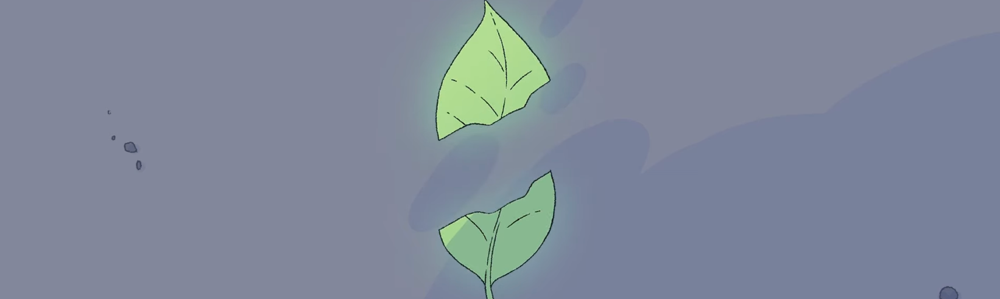
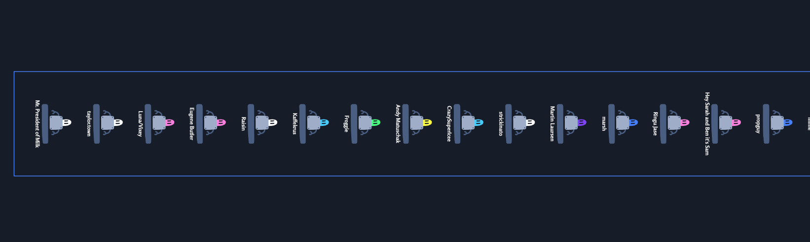

> This update is for [paying supporters](https://patreon.com/TodePond) of my work. 
> It's provided here, DRM-free :) 
> Please only read or listen if you've paid!

<input id="paid-checkbox" type="checkbox"><label for="paid-checkbox">Tick this box if you've paid!</label>

# TODEPOND PONDCAST: Torn leaf zero

<audio controls>
  <source src="1.m4a" type="audio/x-m4a">
</audio>

We return... to another weekly episode of the...

🐸 TODEPOND PONDCAST 🐸

What's new this week?

## Torn leaf zero

This week, I made a [video](https://youtu.be/-FgAHiI3ZNY?si=zSZH01u2jcFchK4J) to announce my- wait I should fill you in first-

I've been creating an 'experimental online gallery' called [torn leaf](https://tornleaf.gallery). It's currently (and always) accepting submissions for its next exhibition.

To promote the gallery, I made a [video](https://youtu.be/-FgAHiI3ZNY?si=zSZH01u2jcFchK4J) announcing its first exhibition, which will be called TORN LEAF ZERO.

The video also gives a sneak-peak to a collaborative artwork made by over one hundred contributors. It's the torn leaf logo, the gallery's logo. In the spirit of collaboration (and colliding worlds), there is no 'one' true canonical logo. There are many many many different variations of the logo, made by many many many different people, and each variation is 'the' torn leaf logo, no more or less than any of the others.

I am still accepting [torn leaf logo submissions](https://elk.zone/mas.to/@TodePond/112239788123432054), if you'd like to get involved too.

I am also accepting full [torn leaf zero submissions](https://tornleaf.gallery/). I'd be delighted if you could get involved. Please tell everyone! I really want to include a huge mix of people. Full instructions are on the [torn leaf website](https://tornleaf.gallery/).

## Non-determinism

This week, I've been working on the essay that I'm writing with [Dave Ackley](https://www.cs.unm.edu/~ackley/). I've been editing together the conclusion, and I've been adding a whole lot about non-deterministic code, which is- which-

Let me explain. When you run some code on your phone, or laptop, or device- When you do something on your phone, you can guess what it will do in most cases, right? In fact, you can _know_ what it will do, because the same thing should happen every time, right?

Wrong! It's not really like that. There's always a chance that your device does something different. But we build our machines so that the chance of that is so tiny- so tiny that we can ignore it.

All the computer code that we write is non-deterministic. But that doesn't mean it isn't [worth running](https://www.youtube.com/watch?v=eQgxFuw8f1U).

## Tiers

If you're reading/listening to this, then you're a paying supporter of my work! (If you're not, then please [pay](https://patreon.com/Todepond) or leave).

You're probably in one of three tiers, Froggy, Flappy, or Beepy, for one quid, two quid, or three quid respectively. I originally setup those tiers for a bit of fun, and to provide some early-adopter bonuses. But recently, I've been thinking about changing them. There are a few reasons for this:

⭐ I want to allow people to pay me less. Some people can't pay three quid a month, but they can pay one quid a month.

⭐ I want to allow people to pay me more. Some people would pay me lots more if I put it down as an option.

⭐ I want to let people choose whatever animal they want. Frog, berd, bot, fly, cat, snail, flatworm, whatever. I don't want that tied to the tier you're in. Note: For storytelling purposes, this change will need to come _after_ the next video.

⭐ I want to escape patreon. I want to be able to accept money _anywhere_, whether that's patreon, github, youtube, or just a stripe link. This means I would need to let go of the 'maximum 99 patrons' per tier.

And I _don't_ want to give any more rewards for more expensive tiers. Recognition for paying more is ok, but not any extra 'screentime' for recognition, if that makes sense.

This [todepond stuff](https://www.todepond.com/wikiblogarden/art/todepond/stuff/) isn't my main career, so I can get away with being more idealistic than usual. I can't lie in saying that I wish I got more money from it because then I'd be able to buy myself more time to work on it, and then it wouldn't take so long to make things. But if I ever do that, it'll have to be with no compromise.

**At the end of the day, this is all my extended art project, not my career, and I can't possibly thank you enough for allowing me to continue it. Thank you from the bottom of my heart! I hope you've been enjoying the journey along the way. Some of you have been here for quite a long time now! And welcome to all the new people this week, who have stumbled here from my various demos and talks recently. Welcome to the pond! And hey, wherever you are in the world, whatever you're doing, I hope you have a great week.**

_Days since tode fell asleep: 467_ 
_Days since bot went missing: 432_ 
_Days since berd flew away: 95_
