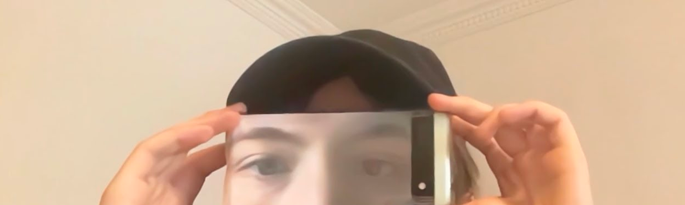
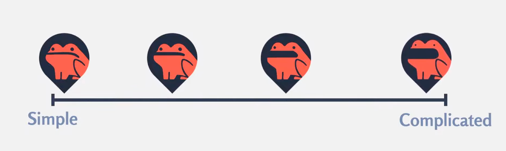

> This update is for [paying supporters](https://patreon.com/TodePond) of my work. 
> It's provided here, DRM-free :) 
> Please only read or listen if you've paid!

<input id="paid-checkbox" type="checkbox"><label for="paid-checkbox">Tick this box if you've paid!</label>

# TODEPOND PONDCAST: Vision pro

<audio controls>
  <source src="1.m4a" type="audio/x-m4a">
</audio>

Ah. It's time for another weekly episode of the

🐸 TODEPOND PONDCAST 🐸

What's new this week?

## Vision pro

I made a stupid little video that parodies the Apple vision pro. Go [watch it](https://youtu.be/QRKnrFEjDF0)!

Previously, I've posted any "bonus" content as unlisted videos. But this one felt polished enough to make public. It isn't a "main episode" though, so I didn't push it out to your subscriptions feed.

Thanks to [British Animation Award](https://www.britishanimationawards.com/baa-2024-nominations/) nominee [Flora Caulton](https://floracaulton.com/) for filming me walk around a department store like an idiot.

And thanks to [Ivan Reese](https://ivanish.ca/) for letting me use a single track from a larger song that was never meant to be heard in isolation like that.

Speaking of Ivan Reese...

## Top 99 Ways To Make Sand

The next video will be the finale of the [Sleeping Tode Trilogy](https://www.youtube.com/playlist?list=PL9uRa69RF-7wCDlX55WjK7-gEb9nb3UPm) and tode will finally wake up. The finale will be called 🏆 **Top 99 Ways To Make Sand**.

I've been doing LOADS of work on it. Let's get you up to speed.

A long time ago, I put down a stretch goal on my patreon. If I ever got to 99 patrons, I promised to make a video called Top 99 Ways To Make Sand. It would be a throwback to the [Top 9 Ways To Make Sand](https://www.youtube.com/watch?v=BDyvjkAs5-Y) video, which was the first one that got more than a handful of views.

I honestly thought that it would take years to reach 99 patrons, but then [Dreamberd](https://github.com/TodePond/DreamBerd) went viral, and here we are.

Either way, I meant it. I did some back-of-the-envelope maths to see how feasible it would be to make a video with 99 parts. Yeah! I can do it!

hahahahahahAaAaaaaaaaa....

## How many digits

I usually plan a couple of videos ahead. I source music, make plans, buy props, etc...

I was looking hard for some appropriate music for the Top 99 video, and I found some fitting ones from the [anjuna](https://anjunadeep.com/gb) labels. But then... my channel started being eligible for adverts.

Anjuna have been very generous in allowing me to use their music for free. But this means that youtube gets to decide where to place adverts in my videos. I don't get to choose. And youtube loves to place adverts in the MIDDLE of my videos.

I really don't want adverts in the middle of my videos, so I switched to the [monstercat](https://www.monstercat.com/) label for the [Arrows](https://www.youtube.com/watch?v=DNBKdU6XrLY) video. They let me pay a [monthly fee](https://www.monstercat.com/gold) to control the ads placement. The only problem is the selection isn't as good as anjuna's.

I couldn't find anything... What should I do?

I found a good track! It was by an independent artist, so I contacted them to ask for permission. But... oh no... the track uses some samples they didn't get permission for... It's probably fine... but not with the risk...

So I shot for the moon. Could I ask [Ivan Reese](https://ivanish.ca/) to make some custom music for me?

"How many digits do I need to pay you?" I asked him.

The answer surprised me. So I took out a mortgage four times my salary and now I owe the bank thousands of pounds a month. I face a lifetime of debt. But it's worth it, because Ivan has made me some amazing original music for the next video.

**Thank you for supporting me with your contributions each month! It's helping me to pay off my six digit mortgage and stop my possessions getting repossessed. Be sure to share my patreon with everyone you know. If you're a zoomer, tell your mutuals that joining the Pond gives them rizz. If you're a millennial, tell your bezzies that my pondcast is literally epic. If you're a boomer then tell your network that my videos make you LOL 😂. If you're in generation alpha, then _look at dis funny froggy so cute_**.

**See you next week.**

_Days since tode fell asleep: 409_ 
_Days since bot went missing: 374_ 
_Days since berd flew away: 37_
