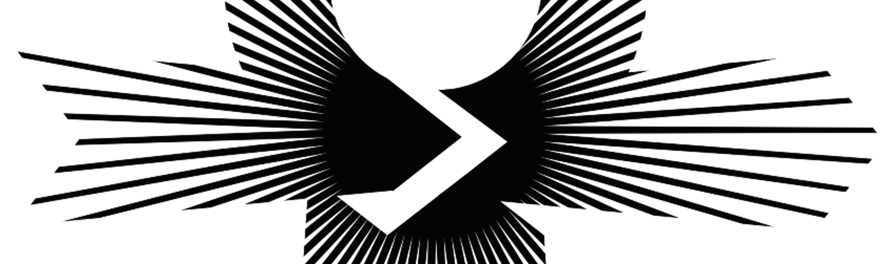
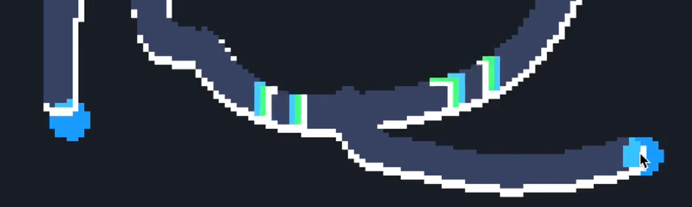
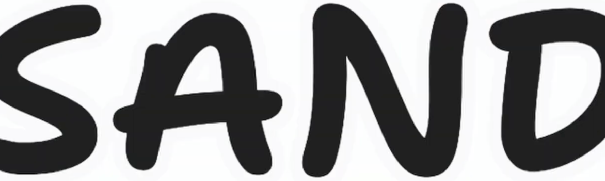

> This update is for paying supporters of my work. 
> It's provided here, DRM-free :) 
> Please only read or listen if you've <a href="https://patreon.com/TodePond" class="danger">paid</a>!

<input id="paid-checkbox" type="checkbox"><label for="paid-checkbox">Tick this box if you've paid!</label>

# TODEPOND PONDCAST: Why we are coders

<audio controls>
  <source src="1.mp3" type="audio/mpeg">
</audio>

# TODEPOND PONDCAST: Why we are coders

And so we return. For another weekly episode of the...

🐸 TODEPOND PONDCAST 🐸

What's new this week?

## Why we are coders

I've been working with [Dave Ackley](https://www.cs.unm.edu/~ackley/). We've been trying to put together an essay to submit to [splash](https://2024.splashcon.org/), where I talked [last year](https://www.youtube.com/watch?v=cBYudbaqHAk&t=6704s).

Specifically, we're hoping to submit to [onward essays](https://2024.splashcon.org/track/splash-2024-Onward-Essays), with an unusual essay about language and code. It's in the form of a dialog between me and Dave, where I ask him some questions, and I try to prod out some answers.

To make it, we had a dialog _for real_ on a video call. Then we transcribed the audio, and edited it a lot. And there's still a lot more to do.

Like I said, it's quite an unusual piece of 'writing'. But I like it. And I think there's something special about it.

Who knows if we'll get accepted, or even finish it in time! The odds feel against us, but I'm trying my best, and I'm learning a lot, and I'm having "big fun" as Dave puts it on his [youtube channel](https://www.youtube.com/channel/UC1M91QuLZfCzHjBMEKvIc-A).

## Fractal pulses

I've been doing more work on [fractal bucket](https://www.patreon.com/posts/todepond-fractal-89529064), a future project.

In fractal bucket, you send paint around pipes. And I've been exploring the different ways of how that can work. I want the paint to move forwards as if it were a pulse of slow electricity, leaving behind a trail.

It's been a little bit confusing figuring out which part of the paint is the 'flowing paint' and which part of the paint is the 'left behind paint'. But at least I know about those two concepts now.

Next up, I need to restructure the engine a little bit to support more complex paint behaviours (of both kinds) (of paints).

## 99 shots

Work has continued on the next video, Top 99 Ways To Make Sand. [Flora](https://floracaulton.com/) has made some more concept art for an animated section. And I've been considering a new music track for one small part.

But the main bulk of my work has been on marking out all the different 'shots' of the video. I'm working from the start forwards, and the end backwards, and they'll eventually meet in the middle. The middle is currently the most un-done bit.

At the start, I'm marking out lots of different sands I'll make, and what I'll say about them. I'm trying to get a good rhythm and balance going. I don't want too many similar sands near each other. They've got to keep you on your toes.

At the end, I'm blocking out some of the weirdest sections, trying to get the pacing right. I'm drawing out some shots quite long - annoyingly long. And I'm cutting some shots shorter, stupidly short and quick. I'm starting to like how it feels, and I think that part is done now.

I'm at a point where I can now start turning the animatic into finished video, even though it still has some gaps. The finished parts will inform the rest of the animatic, which will influence the editing of the finished parts, which will influence the animatic, which will inform the finished parts, which will-

**Thank you, reader or listener, for continuing to support me and my projects. I'm more thankful than I can describe. It really means the world to me. So wherever you are in the world, whatever you're doing, I hope you have a great week.**

_Days since tode fell asleep: 449_ 
_Days since bot went missing: 414_ 
_Days since berd flew away: 77_
