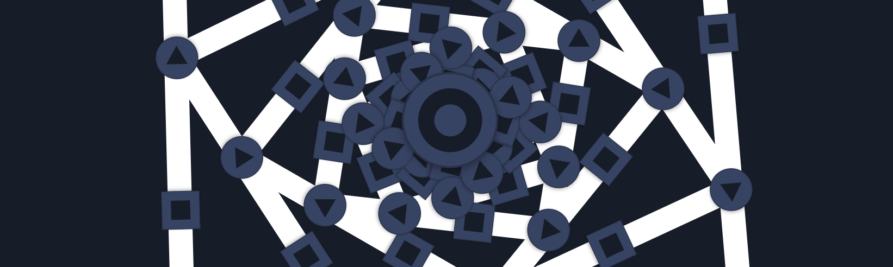
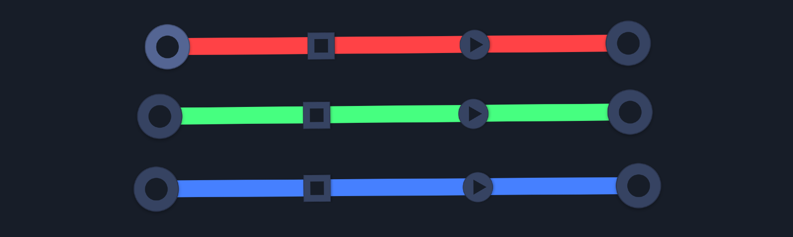
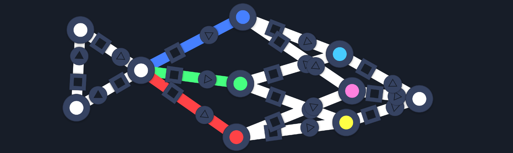

> This update is for [paying supporters](https://patreon.com/TodePond) of my work. 
> It's provided here, DRM-free :) 
> Please only read or listen if you've paid!

<input type="checkbox"> Tick this box if you've paid!

# TODEPOND PONDCAST: Wires to wires to wires

Well hello.

It's time for another weekly episode... of the...

🐸 TODEPOND PONDCAST 🐸

What's new this week?

## Wires to wires to wires

I've been working on [Arroost](https://github.com/TodePond/Arroost). The music-making tool.

In Arroost, you connect different cells together with **wires**. Each wire has a little button on it. You can change the timing of a wire by clicking on that button. Pulses can move along them instantly, or one beat later, or one beat earlier.

And now, you can also connect a wire to a wire. The pulse of one wire can change another wire. And that wire can affect the other wire, which wires up the wires differently.

It's an important feature for making more complex things in Arroost.

## Red, green, and blue

I added another little button to wires! It changes the colour of the wire, cycling through red, green, blue, and white.

_White isn't really a colour of its own: It's just red, green, and blue... combined!_

I will now try to explain how colours in Arroost work. \*ahem\*

When you click on a cell, it **fires** the cell. It gives the cell a **pulse**. Every pulse has three **channels**: red, green, and blue. (Does this remind you of [cellpond](https://www.youtube.com/watch?v=cBYudbaqHAk&t=6704s)?)

The three channels of the pulse travel _seperately_. And they only travel through wires that contain their colour. All pulse channels can travel through a white wire, because the white wire is made up of red, green, and blue.

But only red pulse channels can travel through a red wire. The green and blue parts of the pulse don't get allowed through.

You can use the colour of wires to control the flow of pulses. Filter off certain channels, and then use it as a 'switch', to turn off parts of your machine. Or automate a computer program.

## Mix and match

When a cell fires, it flashes.

The flash shows the colour of its pulse. When you click a cell, you fire all three pulse channels: red, green, and blue. So the cell flashes WHITE.

When you send a pulse through a coloured wire, it only lets through certain parts of the pulse. So it changes the colour of the flash. Send a pulse through a red wire, to make the flash RED. Use a blue wire for a BLUE flash.

Or combine different pulses together to make various different colours. Combine a red and green pulse for a YELLOW flash. Or green and blue for CYAN.

You can make your arroost machine a whole lot colourful! Colours allow you to make more complicated machines. But they also just look nice. So [give it a try](https://arroost.com)!

**Dear reader/listener. Thanks for all your help. Your paid support helps me to justify all of this work & research! I am still hoping to get the video out within 2023 (even if that means December the 40th). Thank you for sticking around. And hey, I hope you have a great week!**

_Days since tode fell asleep: 332_ 
_Days since bot went missing: 297_
