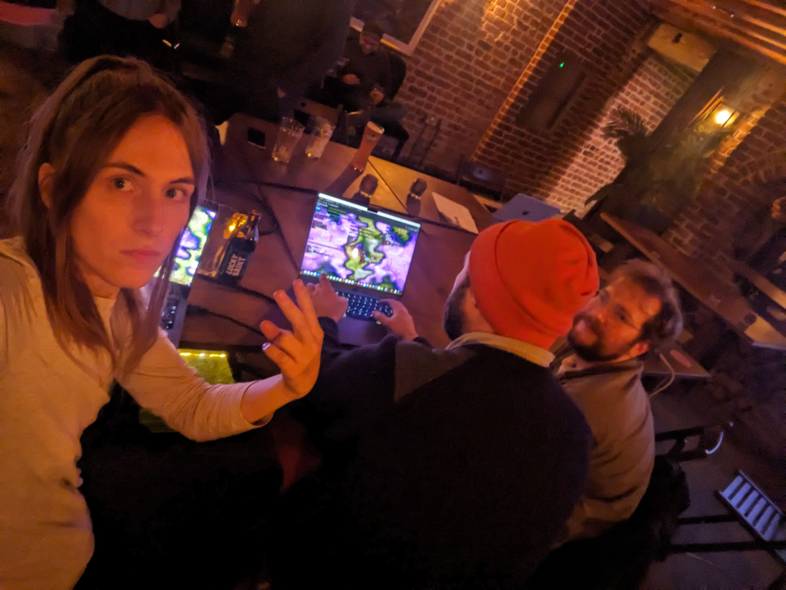
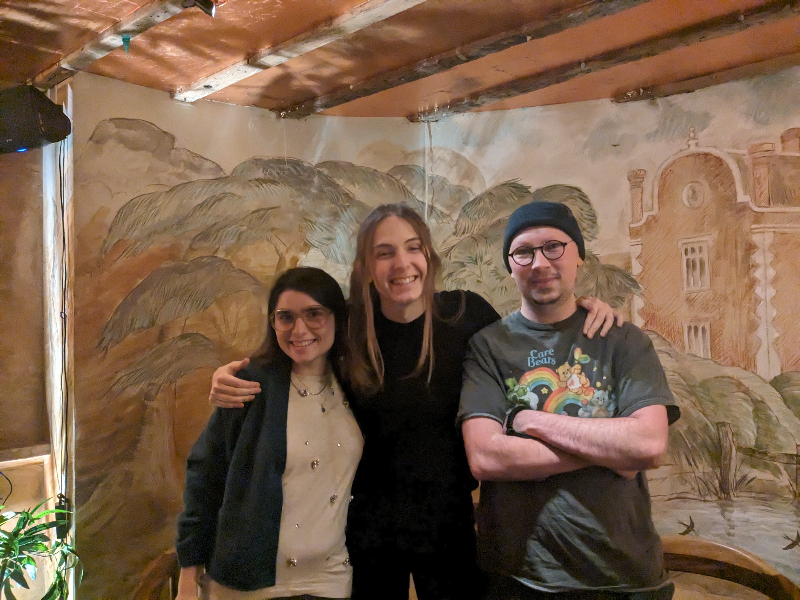
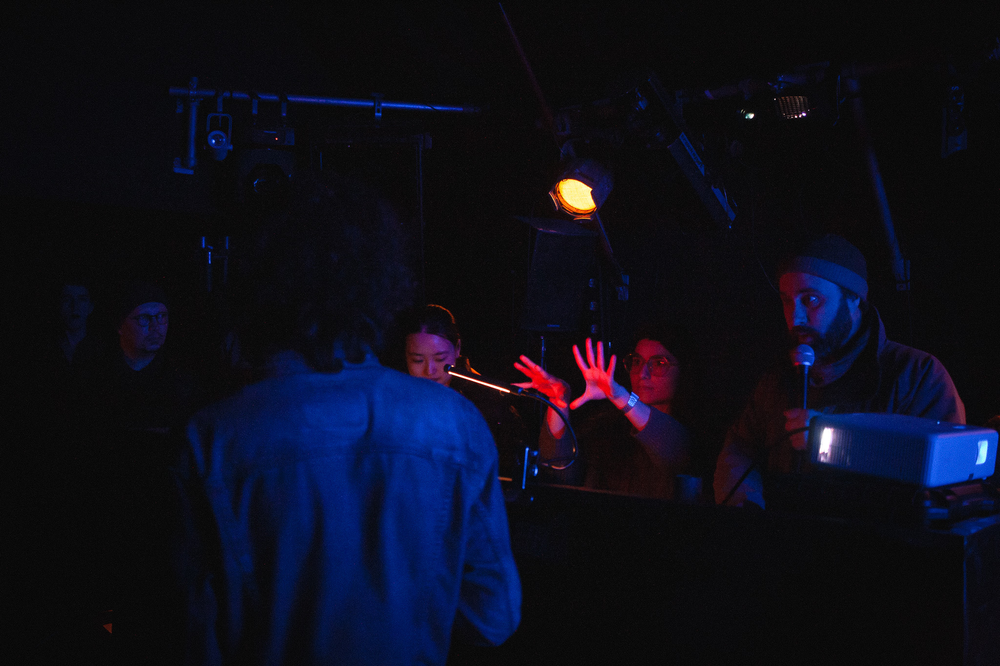

# I went to an algojam

No wait.

 

 

 

## I went to a meetup

I finally made it to a [London live coding meetup](https://lu.ma/6a8uoom3). I was really excited about it and it delivered!

 

In that pub basement, [Daniel](https://syntelang.github.io/) (syntelang) went around the circle and asked everyone what they've been up to. Everyone got offered a turn, regardless of whether they're an expert live coder or brand new. It was fun seeing the delight on people's faces when they got asked to share. 

"Oh. Oh me?"

I learned that there's a huge diversity in all the creative things people are doing. It inspired me, and I learned a lot, and it was extremely wholesome!

"Well, I haven't done any live coding yet but I love photography."

Then the whole room goes "Ohhhhhhh" and "Niiiiiiice" as they share more.

 

 

I have to say: Sitting in the round feels great. There's no stage for— No place— No divide between the speaker and the rest of us. They're not separated from everyone else: We all speak and listen and ask questions together. 

There were some odd little bits and bobs and jobs to do like asking for the wifi password and connecting to the speaker and I could see that Daniel didn't have enough arms and legs to do it all at once, so I offered to help and of course he said yes. It felt like anyone could join in with the organising. You don't need to be special. Daniel would welcome anyone, and I learned to do the same. That's how it felt and it felt great. Very different from some of the other things I'm part of, but exactly the same as [pastagang](https://pastagang.cc).

 

 

When it got to the end, we did a jam in [dotcool](https://todepond.cool/flok), full [pastagang](https://pastagang.cc) style.

While doing it, I felt strongly connected to the people around me, who felt less and less like strangers. People I had only met once before like [George](http://georgeash.co.uk/) (greg). People I had only just met, like [Laura](https://neuromatch.social/@laura_porta) (laura2). And more.

I felt connected to all the people who joined from afar, like [Felix](https://garten.salat.dev/) (froos) and [Tristan](https://midirus.com/) (midirus) and [Hannes](https://guedelhoefer.dev/) (reckter). Three people who I feel I know scarily well despite never having met or even spoken to at all.

In that pub basement, I felt like I was part of something...

Yes, it really did feel that way... despite the fact that the jam got quite chaotic that time.

At that moment in time, that was the most people I had ever seen in one jam. We didn't know how to handle that many people back then, and for the first time, some people expressed having a bad experience in a pastagang space. 

It was all good learning. 

 

 

 

 

## I went to a meetup

A month or so later, Daniel asked if I could help to setup the next meetup's event page so of course I said yes.

Again, we went around the circle, and I met [Bogdan](https://boggo.neocities.org/) (boggo) in person for the first time! And he met Laura in person for the first time too. These are both people I have enjoyed jamming with over the internet. I enjoyed jamming with them in person too.

This time, we talked about plans for upcoming events... There's an algorave coming up... Could we do a pastagang jam at that? Maybe? How would it work?

Well, the good news is that we have a whole bunch of chances to practise, like at the upcoming algojam, called "AlgoRhythms"! It sounds like a knock-off algorave, but it's not. There are just so many events going on in London right now that— so we need to differentiate between them *somehow*. So it's AlgoRhythms.

And we practised at the meetup itself. We all opened up [nudel](https://nudel.cc) and jammed.

Again, it felt special... despite it running quite slowly that time, even on beefy laptops.

At that moment in time, that was the most people I had ever seen in one jam. We didn't know how to handle that many people back then, and for the hundredth time, some people expressed having a bad experience in a pastagang space. 

It was all good learning.

 

 

 

# I went to algojam

I went to an algojam and it changed me forever.

 

An algojam is a special kind of algorave where all slots are open and all slots are short: 15 minutes max. Anyone can sign up to play on the day. Beginner, expert, live coder or not: You can sign up to perform.

So... At the AlgoRhythms algojam, we signed up for a pastagang slot! This feels like a funny thing to do because "pastagang" isn't anyone or anything in particular. It just means we'll plug in the projector to the pastagang space and... see what happens.

 

In the build up to the jam, we did a mini meetup in the venue, all sitting in the round again. And again, I watched as Daniel tried to do more jobs than his arms and legs allowed, so I offered to kick off the session. I'd seen him do it twice now, so I thought(?) that I could maybe(?) give it a go. And of course he said yes.

I tried my best but I do wonder if I raced through everyone too fast with the time that we had. Although it at least felt like a nice way to introduce everyone to each other.

 

As people turned up, I saw Laura (laura2), Bogdan (boggo), George (greg), and some other people I knew like [June](https://trampbunny.tv/) (trampbunny).

We all said yes, we'd be around for the pastagang slot and we'd give it a go! 

 

Hours went by and I watched and listened and sometimes danced badly to many different slots. You never knew what style or angle or approach or tool someone would turn up with. The mishmash of— The wild variance that came from those 15 minute slots felt exciting to me. It was a surprise each time, and the crowd went with it. 

When the slot is short, people will give anything a try.

 

Then it was our turn!

I volunteered to be the idiot with the microphone, introducing pastagang and what it was and how to join in.

Then we did it! 

Music came out of my laptop and visuals came out of Laura's. That way, if I inevitably break hydra, Laura can refresh her screen, and I don't have to. That way, we can keep both the sound and visuals going.

Loads and loads and loads of people joined in, like Bogdan and George and many more in the venue, and many more around the world. It was a convergence of different people! Some of us shared a physical space. Some of us shared a jam. We all shared an experience! 

At that moment in time, that was the most people I had ever seen in one jam. Fortunately, we now knew how to handle that many people, thanks to all the learning. Nudel felt fast and the jam felt chaotic without going off the rails.

 

I invited June to come over to my laptop to take over and do some hydra. It was at this moment that I realised that my hydra pane was broken, so this didn't work out. 

In my "debugging" of this, I accidentally broke the hydra engine, and I forced a bunch of people to refresh. Sorry yaxu!

 

Luckily, enough people filmed bits and pieces of the slot. I stitched it all together into a megamix, which you can watch on [youtube](https://youtu.be/mKE-aMVR0E4?si=aUj9YAwcI7x69k83) or download from the [internet archive](https://archive.org/details/pastagang-rhythms).

 

 

The night continued, and I signed up to do a solo visuals slot alongside Daniel.

I had a lot of fun expressing my inner something with lots of recursion as usual! 

I recorded it on [youtube](https://www.youtube.com/live/n49ahMFMzWs?si=HsTErx5emlg00mbS) but it's nothing without Daniel's sounds happening at the same time. I'll stitch it together whenever the recording of the night gets released on [compute.radio](https://compute.radio).

After that, we did another pastagang slot. At this point, most people had left, so it just us keen pastagangers left. We were doing it for the fun of it and nothing else. 

And this time, we had three of us plugged in. Both me and Laura were plugged in for visuals, and George was plugged in for audio. That way, we were even more resilient to things going wrong. 

And yes, yes. It was very special to me, and it was all good learning. 

 

 

 

 

As I left, Daniel was the last one there, tidying everything away. 

The next algojam is [next week](https://lu.ma/35xf6hly).

 

Back to the [wikiblogardenite](/wikiblogardenite).

