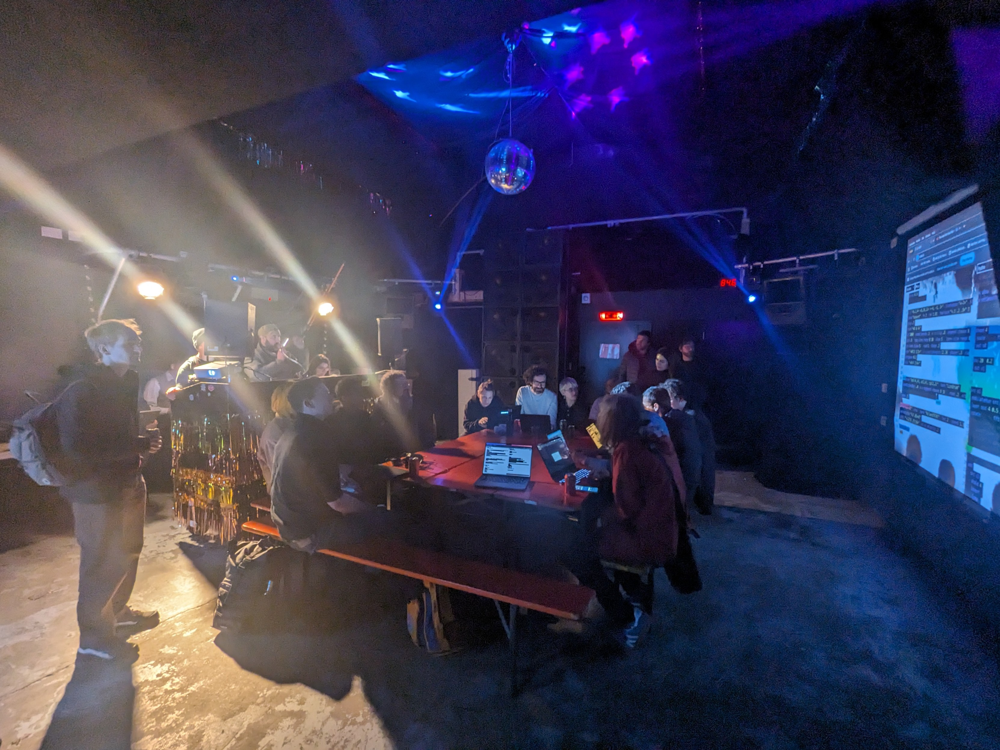
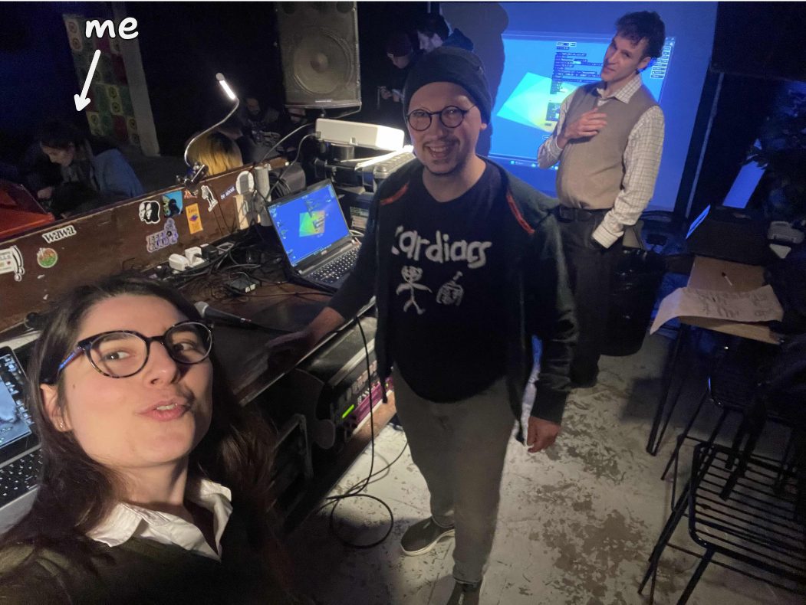
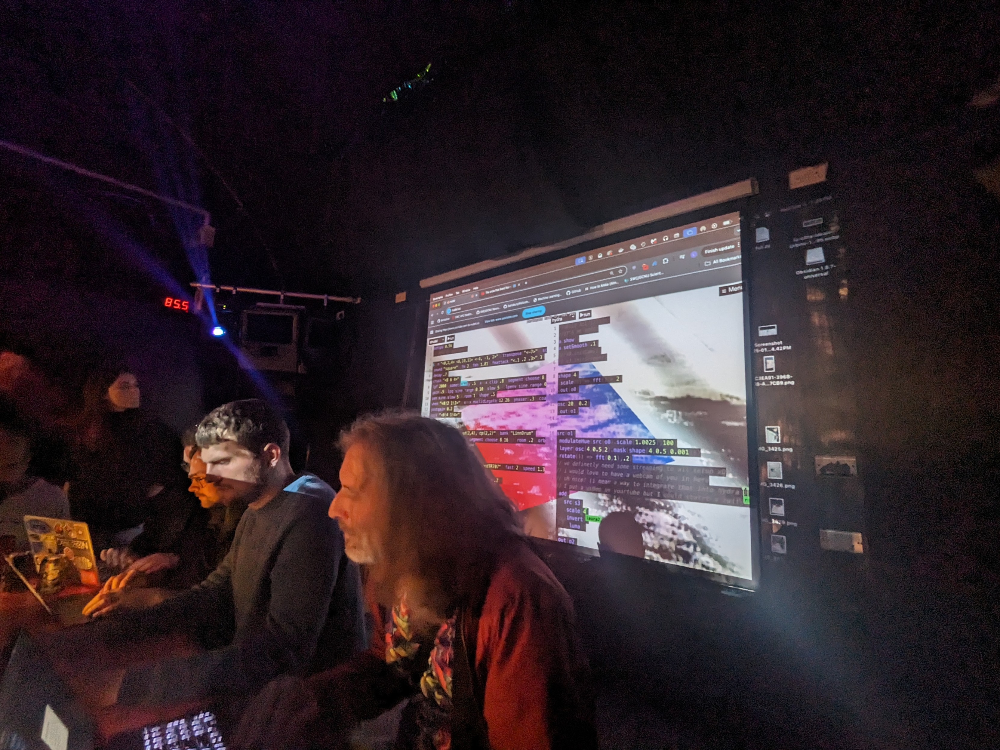
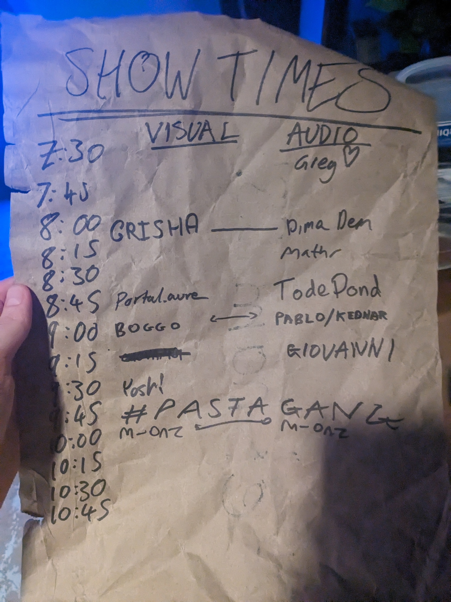
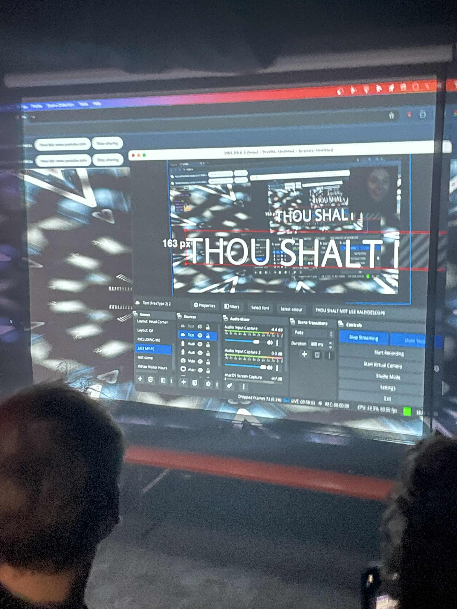
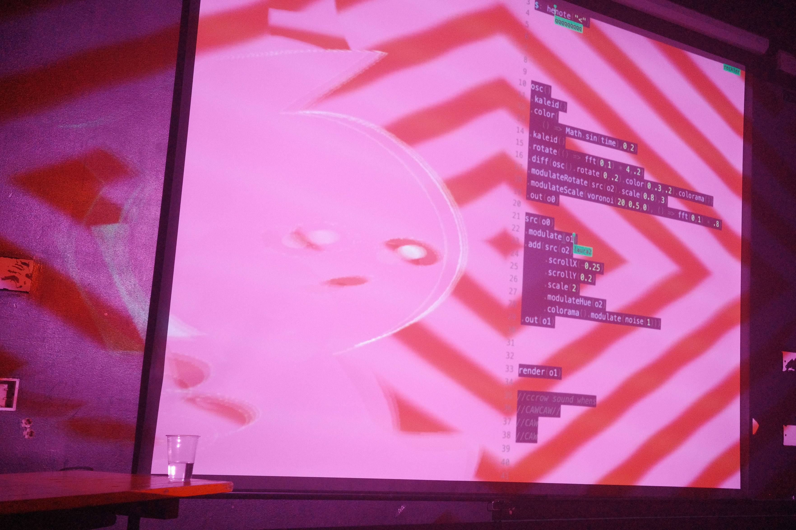
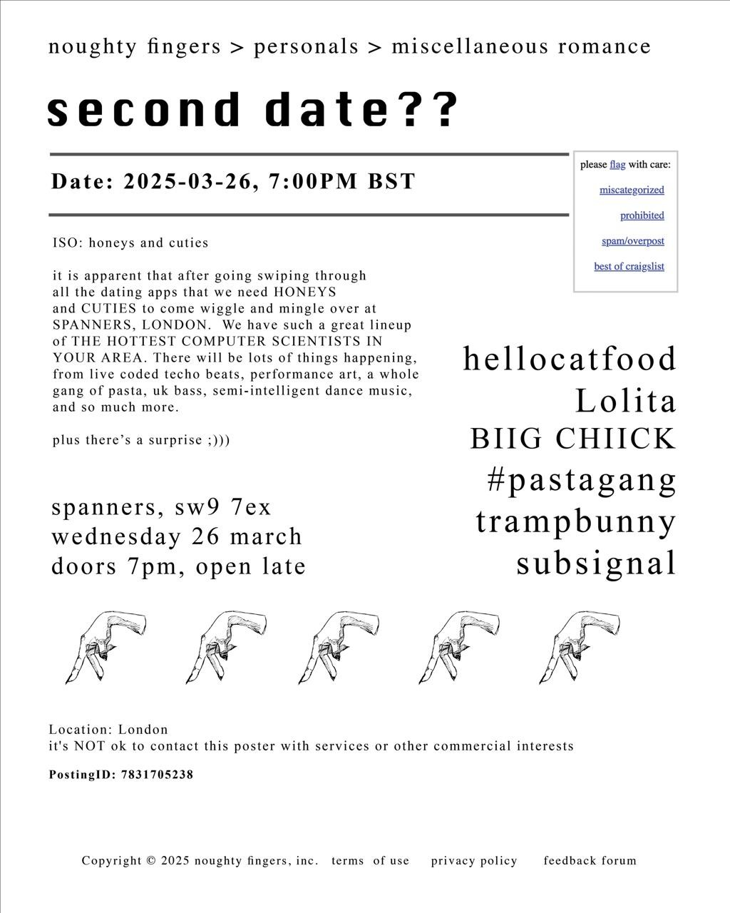

# I went to [another](https://www.todepond.com/sky/i-went-to-a-meetup/) algojam

And it— I turned up late and discovered the room pastaganging already.

[Bogdan](https://boggo.neocities.org/) and [Laura](https://neuromatch.social/@laura_porta) had their laptops plugged in and many other people were sat around the large table jamming. I rushed my greetings and sat down to join.

 

Some people asked me what pastagang was, so I told them: 

[Pastagang](https://pastagang.cc) is this weird phenomenon that has started happening. It's when multiple people do their live coding in the same collaborative space, like in this code editor I'm using right now. You can join too. Do you have a laptop with you? Great. Go to nudel dot see see to see for yourself. That's N U D E L dot C C. Can you see me? Yes, I can see you. There you are.

 

Sometimes, you join and you're the only one there, so you use it as if it's any other single player tool. But sometimes, you join and there are loads of people, like right now: Because this event is going on. I mean, there are lots of us in this physical room jamming together right now. We're all next to each other. But there are also people who have joined from afar.

Yes, that one there is [Lucy](https://heavy-lifting.org/) from Sheffield, and that one there is [Hannes](https://guedelhoefer.dev/) from Germany. And there are loads more. They're probably here because they know there's an algorave.

 

I put down [Tommy](https://mot4i.bearblog.dev/)'s kick drum sample and somebody asked me if I was the one making that sound. I said yes, then I made it happen a bit more.

Someone else asked me how it works. Like how do you make the sounds happen? So I showed them my laptop over my shoulder and I gave them a few things to try. I don't think it was that helpful though.

 

When the event kicked off for real, I left a message in [nudel](https://nudel.cc) to let everyone know when the pastagang slot was gonna be. After that, some people started constructing a big timer within nudel. It counted down until the start of the slot.

 

 

The night started! Many people signed up again and some keen beans filled in any gaps.

This time, I signed up for a visual slot, alongside [Claude](https://mathr.co.uk/web/). And for the first time, I signed up for an audio slot, alongside Laura.

In London, pastagangers tend to sign up for a solo slot as well as a pastagang slot. In Karlsruhe, it seems to be [different](https://post.lurk.org/@froos/114097687889844221).

 

 

Claude brought an intensity that really moved me. I tried my best to keep up with his energy with my visuals but I struggled because it was really / it really was very intense. I loved it.

And it was good practice for me, to do visuals again. I feel like I'm feeling out the kind of style I want to lean into, and I haven't quite got there yet but I'm exploring it. Next time, I'm gonna try to cut back a lot of things and lean in more deliberately to the recursive screen sharing thing.

In my slot, I poked fun at people who hate the kaleidescope visual effect, which was maybe a little bold as I was standing next to some kaleidescope haters at the time.

I recorded it. I haven't edited it or anything. It's [here](https://www.youtube.com/live/LOqPCSJCA6Y?si=rTHcTHX_QE958tQ8)

 

 

I told Laura my plan for my sound slot. I told her I was going to livestream it because I know she sometimes likes to use a screen as an input in [hydra](https://hydra.ojack.xyz).

My plan was: I was going to use my livestream feed as an echo / feedback generator. Like, the sound from my computer will come out of my livestream feed a couple seconds later, which my computer will hear, so it'll then get repeated out my livestream feed again, which means it'll get heard again, and echoed again, forever and ever. It makes a feedback loop, and I can keep it going forever as long as I don't turn down the volume by accident(!).

This is an approach I've been practising in nudel quite a bit and you can see (hear) it near the start of [this recording](https://www.youtube.com/live/59jR3OKHR84?si=qUlKXIZsYtaWcmQt). But normally it's only me who can hear (see) it, so I was looking forward to doing it in person in front of other people.

I guess I did this approach in my stupid livestreams too, like Reaction Reaction, at the [very start](https://www.youtube.com/live/hlsDbXSZ2ko?si=oejVs93GfZ57rpiU) and the [very end](https://youtu.be/54cK-XLu-s0?si=uWX742woDIL31FNy). 

I love how [Joana](https://joanachicau.com/) messes around with and [vandalises websites](https://www.todepond.com/wikiblogarden/scrappy-fiddles/sharing/normalising/live/) like youtube in her sets, and it has definitely influenced me: In both my livestreams and my sets, although I guess they're the same thing.

 

 

I started calm and ambient. I tend to do this because it gives me a feel for the current latency of the livestream, which was pretty short this time. Sometimes I prefer it longer, and I *can* make it longer if I want to, by dragging the playhead "backwards through time", but no. This time, I fancied a short one.

Yes, it's good to start with something calm because it gives me a chance to think in terms of the feedback and how long it takes to loop back around. Then, the noise builds up and up and up, until I get to a point where I want to slap down something bigger, when I can pull away the feedback and keep going from the momentum it gave me. And then, I turn it back on again to pull me into a landing. 

At one point, I jumped away to shout out the stupid little vocal sample I made: "ALL DAY EVERY DAY ALL DAY EVERY DAY".

I saw that Laura was also leaning into the recursive theme. She was infinitely repeating her own generative visuals, and I saw my livestream on her screen there too. She made the infinite tunnel bounce and dance around in response to the sound. It was wild to see those reactions propogate so far down, away into the distant perspective.

 

 

At the end of the set, I messed up by accidentally(!) turning the volume down to zero, which stopped all sound as nothing was playing in [strudel](https://strudel.cc) at the time. Even after turning back on the volume, the nature of feedback means that the pause keeps repeating forever.

I *could* have fixed the problem by "travelling back in time" with the playhead to build up sound again, and then "travelling back to the future" to essentially skip the pause. This could have created some interesting effects! However it was right at the end of my slot so it seemed like a good time to stop.

I like feedback because it forces you to let go of control. You end up steering the music rather than controlling it directly. And you are forced to embrace every single sound you make. There is no undo! When a sound (or silence) enters the loop, it's there to stay.

 

You can watch my sound set [here](https://youtu.be/BXe8mxZ9O3M?si=9pfCBzAnpcWQIHIC). I edited in all the clips of Laura's visuals that I could find.

 

 

When it was pastagang's turn to perform, Laura and Bogdan plugged in again, and Laura did the introduction on the microphone this time. I wanted to make sure that it wasn't me up there like [last time](https://www.todepond.com/sky/i-went-to-a-meetup/), as it seems pretty key to pastagang that the emphasis is not on any single individual but on the collective, and I don't want people thinking that pastagang is me. It's already happened a [couple](https://mas.to/@TodePond/113923179718935825) [times](https://mas.to/@TodePond/114063826359235488) where people thought I made something that I didn't.

Instead, I sat down by the projector with [Pablo](https://fosstodon.org/@kednar) (who I just met in person for the first time) and [George](https://social.toplap.org/@gregson) (who loves the crow sample).

It was a fun place to sit, but I think it would be better if we pulled out some tables and went in the middle with our laptops facing outwards, so that everyone can see them (and jump in if they want). This is something we've talked about doing, but in the panic of getting everything set up on the night, it seems to get lost. 

 

 

The set happened! It was great fun as always, and as always, I felt strongly connected to the other pastagangers in the room, as well as those far away.

Yes, the thing I love most about pastagang is the strong sense of teamwork I get out of it. It feels like an empathy boosting exercise for all involved:

Laura told me afterwards that she feels a connection to [Hannes](https://guedelhoefer.dev/) despite never having met him. She might not even know his name. He's just "reckter". But *who is reckter?*

There was one moment I really liked, when George was editing a riff I had put down. He was changing the notes as I was turning the other dials. I don't know why it felt good to me, but it felt like a moment of high trust. We were both editing the same thing at the same time and letting it happen.

 

 

I'm always deeply impressed by the pastagangers who primarily do visuals. I usually only join in with visuals when it's relatively empty. Yes, but no, when there are three or more of us in the same hydra, I get very overwhelmed. But some pastagangers seem to stay surprisingly calm in those moments.

With strudel, you can all write all your code in parallel if you want to. You don't have to jump into each other's stack. But in hydra, there's no escaping the crossovers. There's only one screen to output to. Sure, you *can* make things separately and then combine them together later, but you still have to say how that happens in the code. There is no avoiding stepping in each other's code.

I asked Laura how she does it. She said she looks at the visuals, and finds a bit she wants to change, then she changes it. I mean, she put it much much better than I can paraphrase, but I think— The thing she helped me realise is that I sometimes try to keep all of the hydra in my head at one time. I try to understand the entire chain as one, when in reality, it's much better to pick out one little piece at a time. I need to let go of understanding everything. I'm only one person! I don't need to understand it all. I'm only one person but pastagang is many. 

 

 

The set finished and I enjoyed the rest of the night through a fuzzy feeling. I didn't drink alcohol. It was the pasta.

And also, I love how varied the sets are in an algojam. Every 15 minutes is something completely different.

Bogdan and Pablo did a metal set! Bogdan on sound, Pablo on visuals. Pablo used a webcam to create horns and teeth imagery. He was somehow coding with one hand and holding the camera with the other. When he switched to two hands for a bit, he gave me the webcam. I tried moving it forwards and backwards into the screen and back in time to the music. I also pointed it probably too directly into my mouth. There's a supercut of their set [here](https://drive.google.com/file/d/1wkH6xWwT4bz45OeCHU4td_KqKM9rG2Fr/view?usp=sharing).

Laura did some radical plant visuals over the top of [Daniel](https://social.toplap.org/@synte)'s sound, which featured a heavily slowed down [Girls Aloud song](https://youtu.be/Wy3SV2fvoG8?si=WBUjW95ICdfJ4edm). I only know this because he called me over to point it out. It was so distorted that you wouldn't notice unless you were looking for it. (This song has been used as a sample quite a bit in the pastagang room).

For one set, a man and woman whipped out two handheld game consoles. Or at least, they looked like game consoles, like gameboys or something? They were custom built or modified or something, I don't know. When the music started they immediately began jumping up and down with such ENERGY and they didn't stop until the very end. It really put a smile on my face. The visual was a 2D platformer game that the woman was playing. It was inspired! We were all cheering on and the music was so fitting. I wish I knew their names. 

There were so many slots, I can't cover them all. 

[Giovanni](https://compute.radio/)'s music blew me away again. I'm still processing the set he did at the first algojam. It had such a build up both times and we spoke afterwards and he linked me to an [album](https://prestorecords.bandcamp.com/album/ils) to check out to keep going down the rabbit hole. 

Yes, sorry, there were so many slots. 

 

 

At the end, we did one more cheeky pastagang slot. We were going to wrap up but I asked Daniel if we could do one more and of course he was up for it. 

This time, the venue was pretty empty again, and it was just us keen beans remaining.

By this time in the night, I think everyone is a bit more warmed up and loose and all the cross pollinated inspiration is sinking in. And everyone is willing to go a bit silly. Anyway, Laura pasted in her code for "little guy", a now recurring pastagang character. As the name suggests, they're a little guy made out of hydra shapes and they clap and dance to the music, and often get warped into all sorts of contorted shapes by the end. Poor little guy...

Someone said "Who is Reckter? They're typing so much." And I repeated it on the microphone, which you can hear on the [recording](https://youtu.be/HCcSHMu0gzg?si=Ry9mwF056SD0Dwqt). Then I handed the mic to someone who started saying words in time to the music, which you can also hear on the [recording](https://youtu.be/HCcSHMu0gzg?si=Ry9mwF056SD0Dwqt).

We kept going a little bit past the end of our slot. It felt like we could have done another hour at that point. But Daniel reminded us that we'd get kicked out, so we wrapped up there. 

"Sorry."

"Thanks!"

"Hey pasta, ciao."

"Fucking banging."

... which you can also hear on the [recording](https://youtu.be/HCcSHMu0gzg?si=Ry9mwF056SD0Dwqt).

And Laura fistpumped me again though intentionally not as hard as [last time](https://www.todepond.com/sky/i-went-to-a-meetup/).

 

 

One recurring thing I hear from pastagangers, and notice in myself... is that, as we get in more and more practices like this, it becomes less overwhelming.

Yes, the first time I joined a jam with that many people in one editor, it was intense and overwhelming and I couldn't keep up. It felt like the jam was out of control, but— I mean the jam is always out of control in the same way a flow of water is. But jams and water can both be steered by building hills and slopes and troughs.

I think we've gotten better at mass jamming by letting go of control and learning to let it flow, guiding it here and there, making minor adjustments, taking away space in one place and creating it in another. It feels great.

If you delete a drum beat, it means that more drums will grow, and they'll probably grow back bigger. It seems paradoxical at first but it happens. It's the same as growing [plants](https://www.pastagang.cc/paper/).

 

Okay, enough of this.

The next pastagang slot will be at [Noughty Fingers](https://ra.co/events/2117681).

