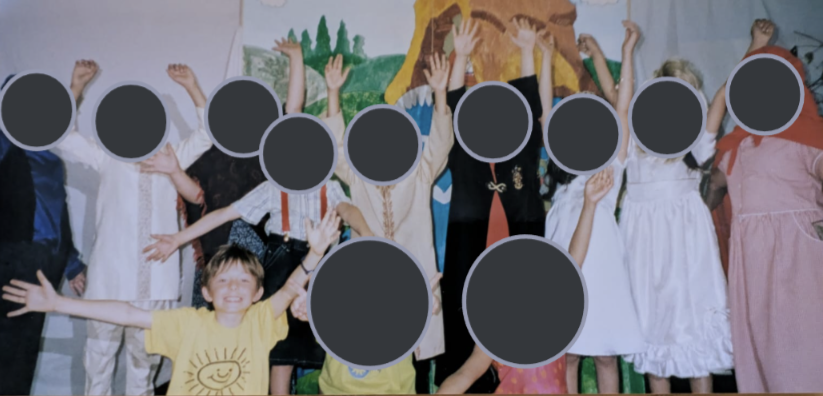
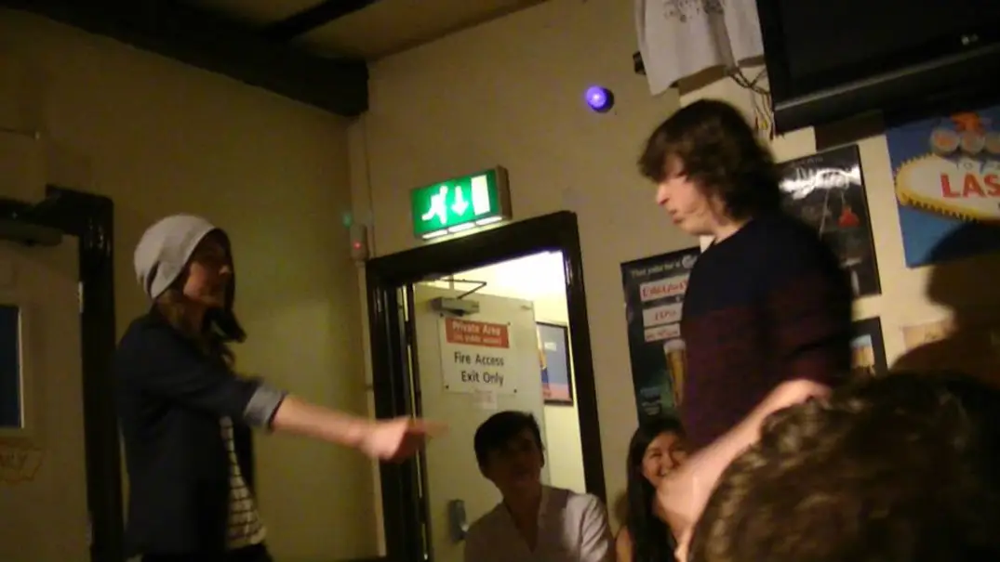
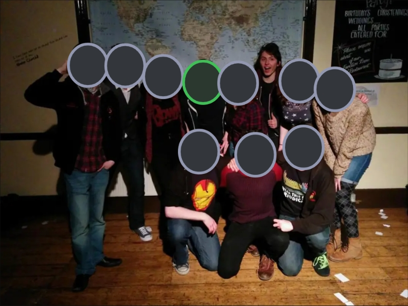

# Drama club

When I was a tiny kid, I was quite loud and performative, yet somehow lacking confidence at same time. 

So my parents signed me up for a drama club outside school.

## Drama club 

I was shy at first, but after about 30 seconds I was fully immersed / thrown in. 

We played games, we performed, we acted, we improvised. And I attended for what felt like a long time.

It was great. It was my escape. I could be anyone I wanted to be! I loved drama club.

## Drama club

When I was a bit older, I went to another drama club and I also loved it. 

My favourite moments were the improv games, like "Freeze".

A scene would be taking place in the middle of the circle, with all of us sitting around in the round. Then someone shouts "Freeze" and the performers in the middle have to freeze still.

When this happens, one or more people walk into the center of the circle from the audience, to tap on one of the frozen performers. 

When you get tapped, you have to leave the scene and join the audience, with the tapper taking your place.

Then, the new actors in the middle *make something up* and start a new scene based on the frozen body positions they assumed.

It was often very silly. And we'd all be laughing together as a group.

 

 

When you step into the circle in Freeze, anything can happen. You can be in any place at any time. You can be doing anything as anyone. You don't know what it might be. It might be up to you, or it might be up to someone else. Or sometimes it seems to happen automatically.

 

 

Time passed and I turned into a teenager and my feelings towards the drama club changed.

What was once a fun escape became anxiety. The other people there became less interested in the games and more interested in "boys" and "girls" and sitting apart in gender divided groups. And suddenly I didn't feel like I could be there anymore. 

So, one day, I refused to get out of the car to go to the club and it was a sad moment for me, giving up on something I loved.

## Drama club

When I was at university, I went to drama club sessions, specifically the improv sessions. And I loved it.

Yes. I really could be anyone I wanted there. I was surrounded by queer people too, which helped.

 

We even played "Freeze". It was great! Except—

Well, I enjoyed Freeze when we played it in the sessions, but we also did it in shows.

We put on lots and lots and lots of— many shows and I hosted lots of them too, which means I was the idiot at the front of the stage warming up the crowd and doing the audience interaction stuff and stuff.

I really thrived in this role. I was pretty fearless (some might say "numb") at that point in my life, so I felt relaxed in front of the crowd. And for me—

 

 

Whenever we did "Freeze" in a show, it felt very different. 

It was no longer a game that everyone was involved in. No, it was just five or six performers taking part at the front, and everyone else was just watching.

It was no longer "in the round" with everyone standing / sitting around in a circle. No, there was a clear divide between the performers and the crowd, the stage and the audience, the senders and the receivers, the setters and the getters, the coders and the users. The fourth wall was in the way.

 

 

In an improv show, you're supposed to find the performance impressive. You're supposed to think "Wow that's amazing! How do they think as fast as that?"

And of course, the answer is that they don't think as fast as that. There are countless tricks and techniques that give you a winning formula on an improv stage, with the most important being "teamwork". 

An improv show is less of a comedy and more of a magic trick, if you do it right. The watchers don't do improv, and they don't know how to do it, so they get blown away with the mystery of it all. "How did they do that????"

 

 

I don't like improv shows. I don't like watching them and I don't like performing in them. 

This might be because I've done way too many. Yes it probably is. 

But it's also because I don't like how big of an ego trip it is for the performers. It's all about showing off and being the center of attention, and seeming impressive, when it really isn't.

I like doing improv! But I don't like improv shows. I just like the games: The ones you can do as a big collaborative group. 

When you do "Freeze" in the round, the performers are also the [audience](https://algorithmicpattern.org/2024/03/25/the-meaning-of-live-from-art-without-audience-to-programs-without-users/). There is no divide. It's a [jam](https://pastagang.cc/paper).

## Drama club

A friend of mine (coloured green in the photo above) shared my dislike of improv shows. So the two of us put our heads together to try to come up with something better. In fact, we decided to set up our own drama club, called "Spinoff".

And this drama club changed the course of my life.

 

 

 

 

Back to the [wikiblogardenite](/wikiblogardenite).

