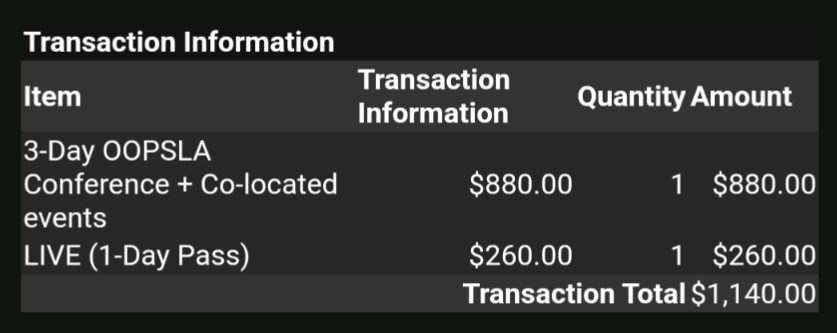

more context [here](https://www.todepond.com/wikiblogarden/better-computing/dynamicland/website/new/)

> Lu:\
> my day nine dynamicland website reaction: 
> 
> dynamicland is for "real people in the real world"
> 
> as opposed to what? fake people in the fake world?

> Josh:\
> presumably when Bret says that he's talking about the richness of physical copresence and physical media, vs the narrowness of the digital
> 
> (curious: was this actually not clear to you? or is the intended meaning clear but there's something about the rhetoric you don't like?)

> Lu:\
> i'm genuinely puzzled by the framing. if i want to reach and help "real" people, then the internet/digital/online world is way more effective than the physical world for me.
> 
> i feel like so much is missed from the framing, it feels sad

> Lu:\
> also i appreciate your responses Josh! it's helping me to get a better understanding

(and then I went on to ask about something else, which Josh replied to at a later point in the thread) 

> Josh:\
> I don't think Bret is trying to imply that things done on laptops / through the Internet aren't real. that would be kind of ridiculous.
> 
> I think his point is that there is a reality ignored by 99% of computing, to our grievous detriment: physicality, copresence, embodiment...

> Josh:\
> so I'm still fuzzy on whether your issue is with
> 
> 1. that point
> 2. the language he's using to make that point
> 3. you don't think that's the point he's actually making, and you take issue with the point you think he's actually making

> Josh:\
> (an example of an issue someone could have with #2: "Bret's use of 'real' is loaded language – he's using it to argue for the physical over the digital without making a real argument; he's begging the question")

> Josh:\
> there are big Qs here! like are those physical things worth losing global connectivity? but I'd rather talk about those questions directly, not through the lens of rhetoric.
> 
> (like how I'd rather discuss the +s & -s of academia, rather than focus on "putting it in the bin".)

 

 

> so I'm still fuzzy on whether your issue is with
> 
> 1. that point\
> 2. the language he's using to make that point\
> 3. you don't think that's the point he's actually\ making, and you take issue with the point you think he's actually making

(4) the truth is, i don't have an issue with it. it makes me feel sad, and slightly confused, and that's ok! it's ok to feel sad about something :) i'm trying to understand the perspective more to hopefully become less sad and confused about it

> Josh:\
> (an example of an issue someone could have with #2: "Bret's use of 'real' is loaded language – he's using it to argue for the physical over the digital without making a real argument; he's begging the question")

hmm no, i think Bret's use of "real" is a great way of expressing dynamicland's values in an impactful way. it gave me an emotional response!

> I don't think Bret is trying to imply that things done on laptops / through the Internet aren't real. that would be kind of ridiculous.

that's right, i agree. i don't think he's implying that, because that would be ridiculous(!)

> I think his point is that there is a reality ignored by 99% of computing, to our grievous detriment: physicality, copresence, embodiment...

i also agree, that's what i thought.

it represents a call to shift focus away from one thing to another thing, and this is largely what makes me sad/confused:

it doesn't seem like the call is to do a realtalk approach *as well as* our current approaches. it seems like the call is to do a realtalk approach *instead of* our current approaches. am i right in thinking that? 

it makes me sad that we'd throw away so many things we currently do. maybe that's me just mourning, and i should get over it 🤷‍♀️

anyway, to express this feeling of loss, i stuck to using the same language repeatedly used on the website itself, of "real people" and the "real world" and parodied it in a way, as a way of venting about it

it helped a little!

> there are big Qs here! like are those physical things worth losing global connectivity? but I'd rather talk about those questions directly, not through the lens of rhetoric.

hmmmmmm

"rhetoric" seems like a loaded word here

and i'm not entirely sure what it means, but maybe we're using [this definition](https://worrydream.com/RhetoricAndScience/)?

it feels like there's some clash of worlds going on here, with my slightly jokey, tongue-in-cheek style, and a more serious world, that wants to work together to solve problems

there are also big questions about how much our views and feelings should be explicitly stated versus how much can be subtext, and left vague, for the reader to interpret [in their own way](https://www.todepond.com/wikiblogarden/speak/accurate/).

ie: maybe i shouldn't be so careless with my flippant remarks 

in all honesty, i don't think i'm using rhetoric, because i'm not trying to convince anyone of anything. i am trying to express my feelings of sadness and confusion to try to reach others in some succinct way, and it seems to have worked!

> (like how I'd rather discuss the +s & -s of academia, rather than focus on "putting it in the bin".)

ah so this is referencing my previous two posts about academia:

- [Academia](https://www.todepond.com/wikiblogarden/academia)
- [Academia from the outside](https://www.todepond.com/wikiblogarden/academia/from/the-outside/)

and hey it was satire :)

> Ok I’m just kidding. But you can understand why though? It’s a straight-white-male-dominated world obsessed with intellectualism. The whole ‘paper process’ saps out all the fun and feeling, devoiding your work of any emotion. “All we need is rational thought and reason” making no room for expression and empathy. No wonder it's so—

i think there is a role for satire and humour in society. i think it can be harmful to reduce all criticism down to calm meaningful debate. it can become a way to squash descent and resistance. i don't think the problems with academia are anything to do with pros and cons of specific practices. i think it's to do with power imbalances[^power], and money[^money].

 

 

thank you again for your responses Josh. it's all in good faith, and I appreciate you challenging me in these ways and I hope you will continue to do so

[^power]: [ACM Considered Harmful](https://se9book.wordpress.com/2011/01/24/acm-considered-harmful/)
[^money]: [ACM Profits Considered Harmful](https://cacm.acm.org/opinion/acm-profits-considered-harmful/)
