# Work

This is how I make things.

## Learn

First I talk to someone, and I learn something.

Then I talk to someone else, and I learn something else.

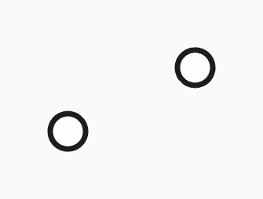

Then I talk to someone else, and I learn something else.

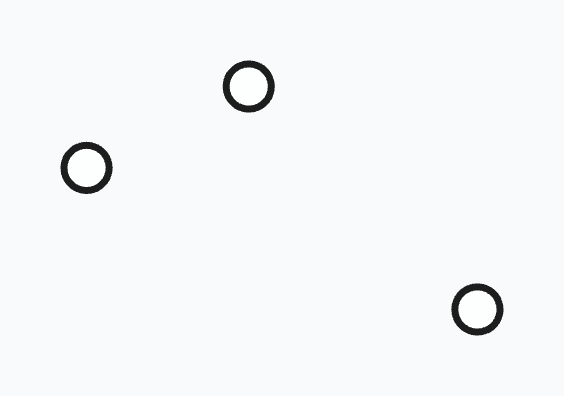

Now that I know three things, I can start to figure out how they're positioned in relation to each other.

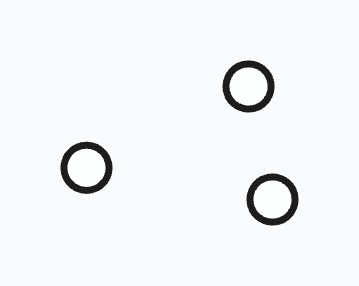

I continue this, learning more and more things.

Then I leave that topic for a while, and learn a bunch of things in a completely different topic.

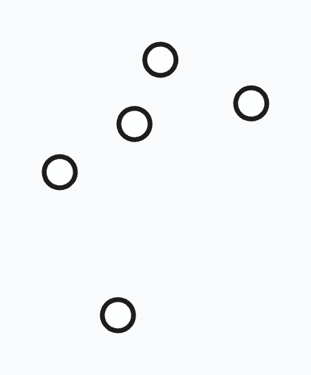

Then I leave that topic for a while, and learn a bunch of things in a completely different topic.

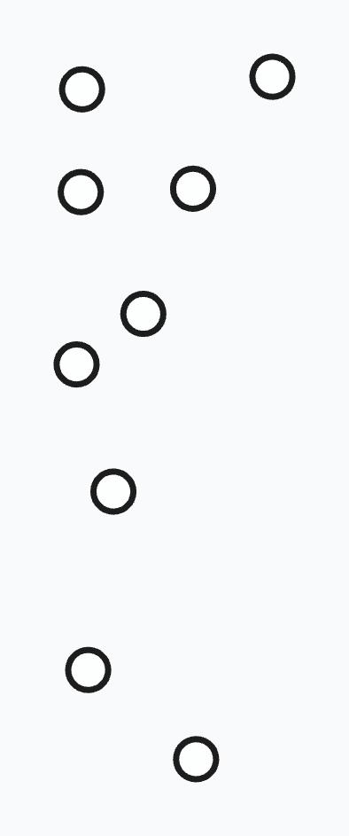

Now I have learned lots of things, I start to connect related things together.

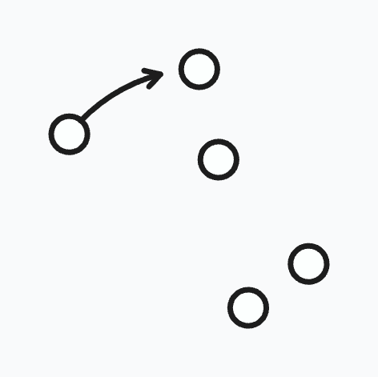

I make connections in my different topics.

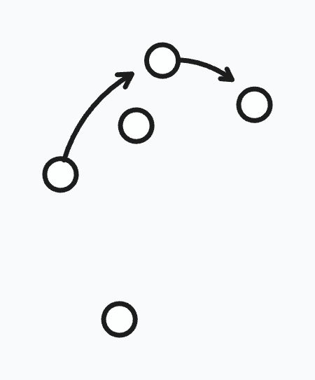

Oh wait! These two topics are connected to each other.

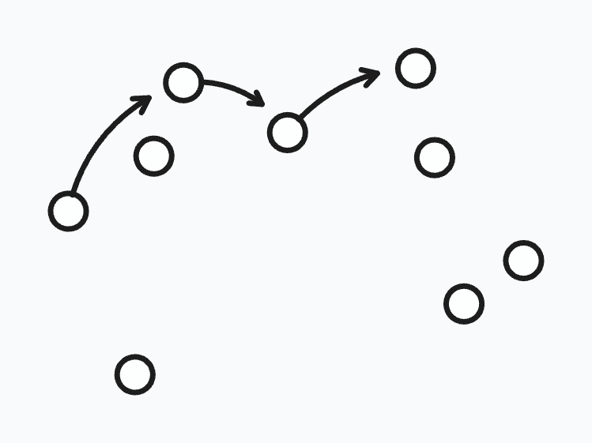

I continue joining dots.

Sometimes I find a pattern or a flow. I wonder what it could mean — what the bigger picture is.

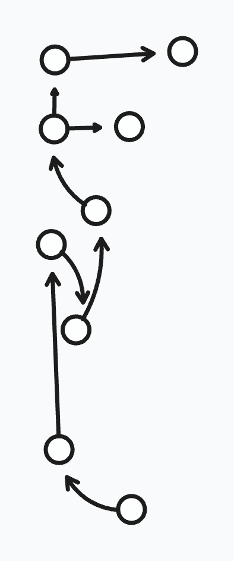

I zoom out to take a look at the bigger picture, with a zoomed out view. No, this doesn't look right.

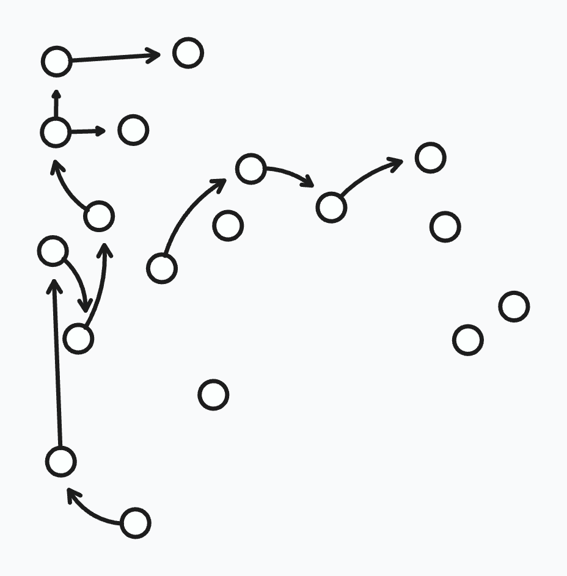

I try different ways of arranging the information. What if I turn that part this way?

Wait, I can turn the whole thing now!

Now I can join them all up.

And I give it a name. I place it in a picture, and present it as a 'piece' — a finished artwork.

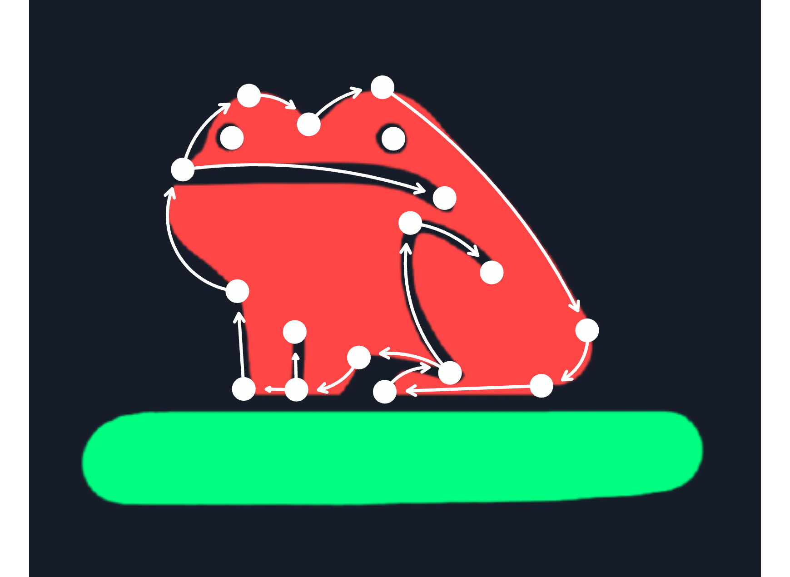

I leave you with the finished thing only. I rub out my workings.

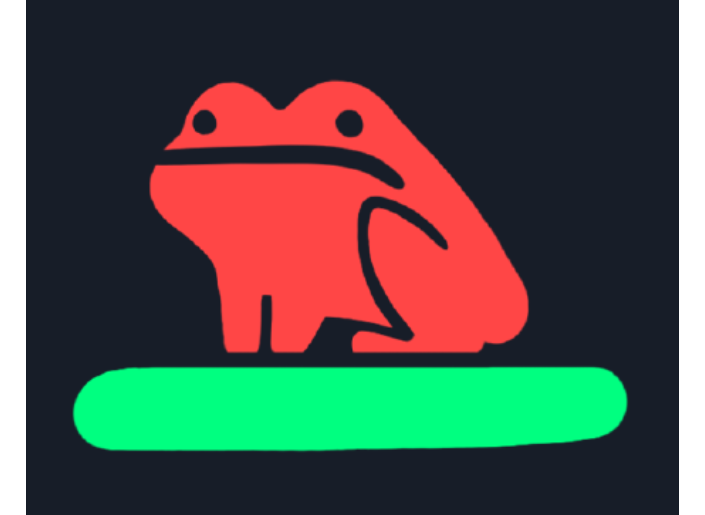

 

Back to the [wikiblogarden](/wikiblogarden).
