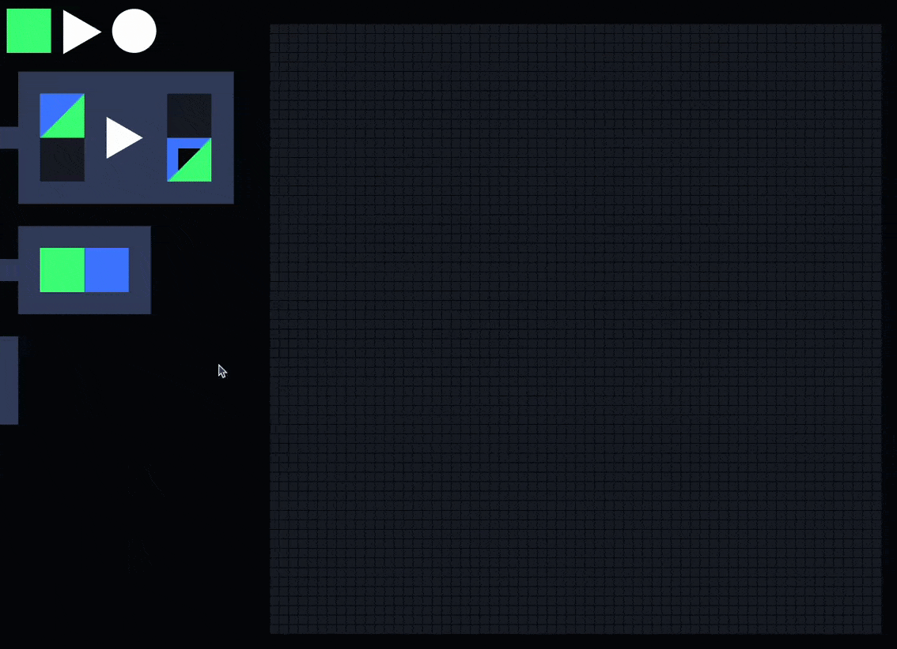

# Conservation and stamping

- What is the "conservation" part that I talk about in [this post](https://www.todepond.com/wikiblogarden/cellpond/the-weirdest-thing/)?
- What is conserved?
- Why is stamping weird?
- What was the mainstream thinking before?

## Conservation

The 'conservation' is the conservation of cell colours from the LHS (left-hand-side) to the RHS (right-hand-side) of the diagram. I hoped I explained it in that post, but I've always found it a tricky one, so let me know if there's anything in particular that I lost you on 😅

eg: Look at this rule.

^ it means:

When green or blue is above black... 
Then replace it with green or blue below black.

Here it is in action.

Notice how green falls as green. Blue falls as blue. 
The colour of the falling cell has been 'conserved'. 
That's what conservation is.

## Stamping

You can stamp a cell like this: 
(Ignore the visual bug - the square hole should also cover the green half)

It overrides cellpond's natural in-built conservation. 
It makes the 'replacement' randomly pick between green and blue, instead of using what's already there:

It's weird because nothing like it has been done in this space before. 
And when I told it to some people who do work in the space, they found it weird. 🤷‍♀️

## Magic symbols

Previously, things used ---

Ok, I should really get back to work now. I'll continue this some other time :)

