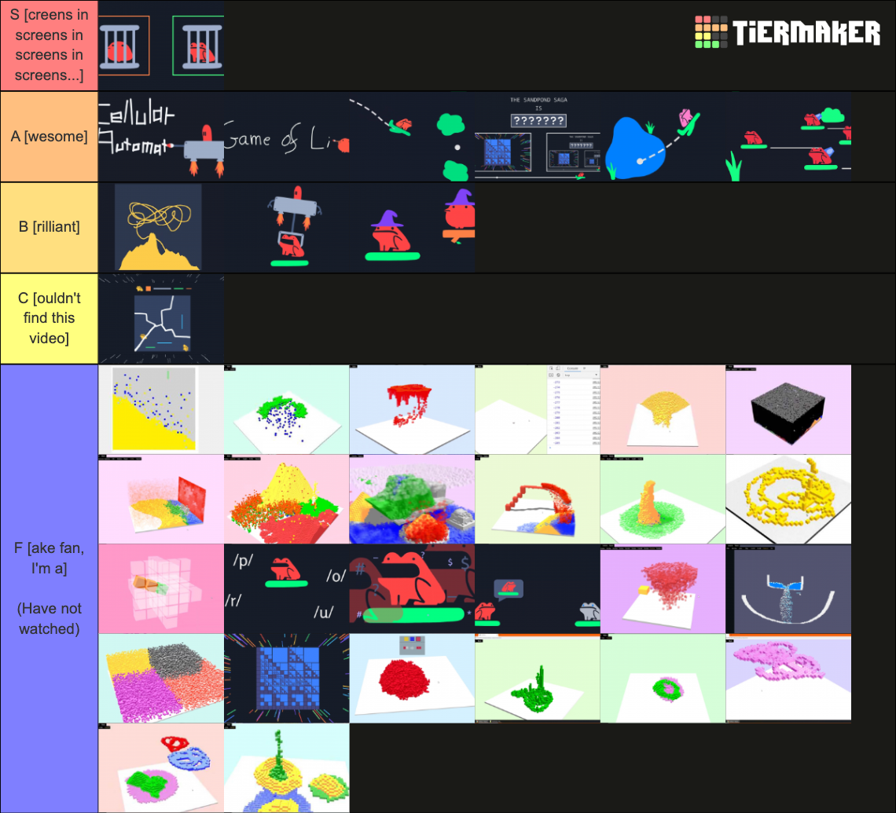
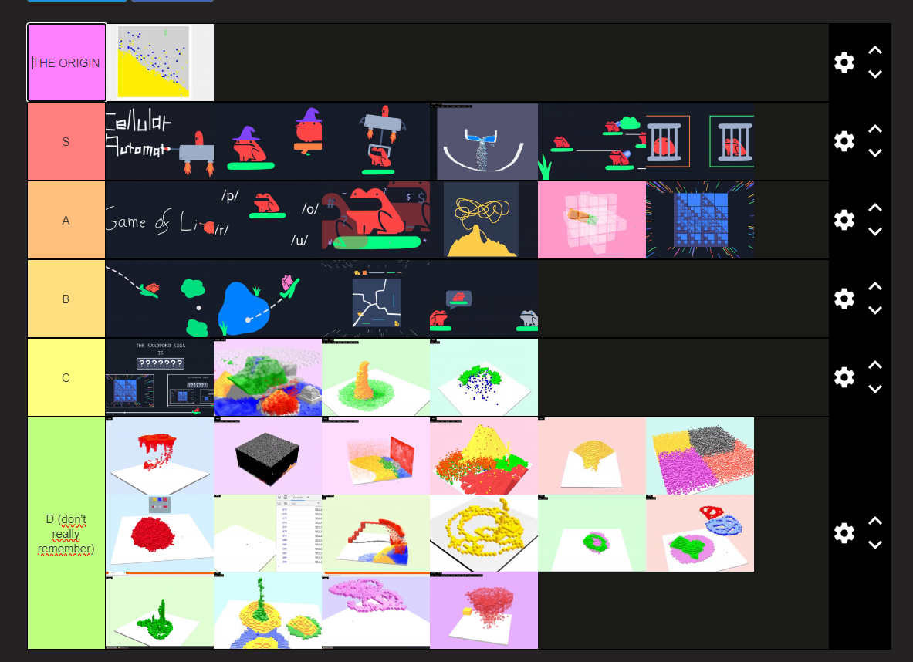
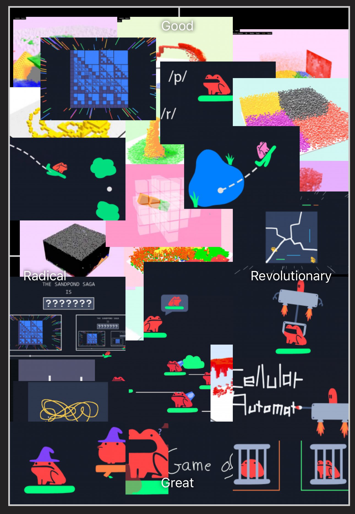

# Good and bad analytics

Analytics can be bad or good. Here are some ideas for both.

## Bad analytics

- Track a user's eye movements on your advert 
- Time an employee's loo break.
- Record someone's speech in a place that feels private.
- Guess demographic information. For example, [guess their gender from their first name](https://youtu.be/suv76aL0NrA?si=d86kL8LrsWFhr-Ch).
- Track everything "just in case you want it one day".
- Get someone to agree to all of this by giving them a long and hard-to-read terms-and-conditions.
- Pump it all into a large language model.
- Desperately watch the 'like counter' go up.
- Grade children with a sit-down test at age 6.
- Judge public opinion by reading tweets.
- Don't campaign against a first-past-the-post voting system.

## Good analytics

Here are some ideas I have for good analytics.

- Listen to when the audience laughs in your comedy routine.
- Welcome thoughts and feedback from your online audience. Read the good-faith comments. Bin the rest.
- Develop a trusting relationship with your class, and empower them to assess their own understanding during a lesson.
- Check your class's self-assessments by asking them to 'be the teacher' and show you (or their friends) what they just learned.
- Remember that you are not your work. Enjoy improving your stuff, while knowing that it doesn't affect your self-esteem (positively or negatively).
- Invite people to fill in a 'guest book' on your website.
- Be a true part of yourself regardless of any success/failure. Don't seek to change that. Seek the people that 'get you'.
- Raise money for charity and notice which social media platforms donate the most.
- Ask your paying supporters to put your videos in a [tier list](https://tiermaker.com/create/sandpond-saga-episodes-16352180).

Tell me what you think! My contact details are on [todepond dot com](/).

 

Back to the [blogi](/wikiblogarden).

