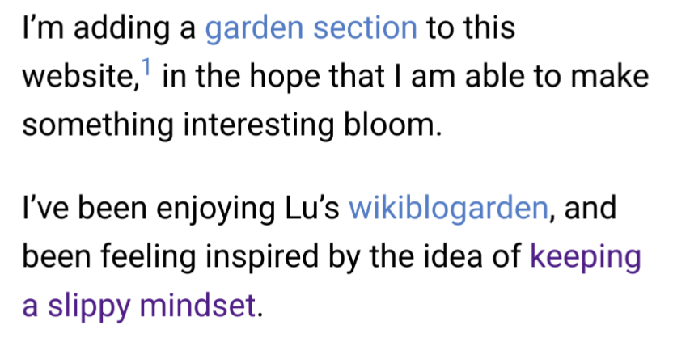
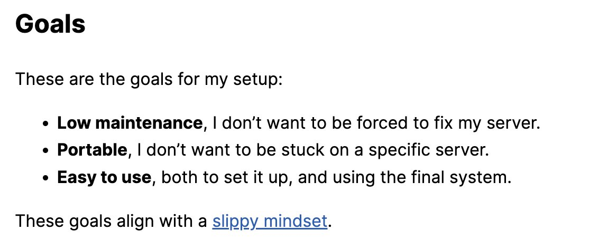
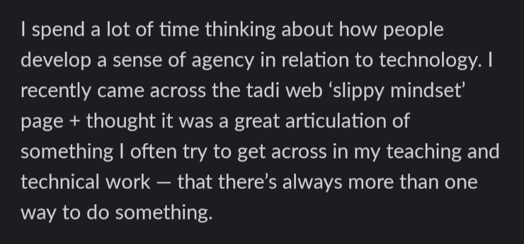
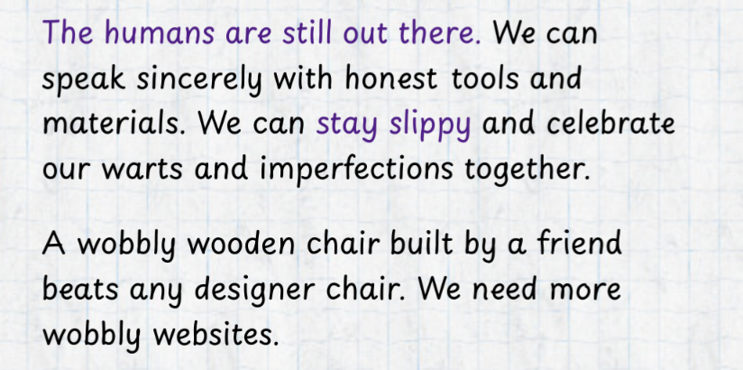

# DEATH OF THE TADI WEB: Archive

I'm sorry to say this... but...

THE TADI WEB IS DEAD! [AGAIN](https://www.todepond.com/wikiblogarden/tadi-web/death/who/)!

 

 

Now all we can do is look through all the archives, from many years ago. Here are some I found on discord:

> Thank you for all your participation in yesterday's tadi web discussion! Couple of follow up thoughts:
>
> ✯ In many ways, the "slippy mindset" is a burger king idea for trying to solve the tadi web problem statement (ie: adhering to all "better computing" communities at the same time).
>
> ✯ There can be lots of debate over whether a particular technology is "slippy" or not. But that's not what it's about. A practice can be slippy. A technology cannot.
>
> Q: "Is X technology slippy?"
> A: "It depends on your practice of using X technology."
>
> It's the slippy mindset, not the slippy library or stack or whatever.
>
> ✯ I think "vagueness" is a valid criticism of the tadi web. What does it really mean to adhere to the tadi web? That's what I want to figure out. And it's a moving target.
>
> ✯ The tadi web is a web. It's a hypothetical network of various communities/movements, and it exists by definition. It's a description of that existing network. A sub-goal is to understand the nature of that network, and to make it stronger.
>
> The tadi web is not a replacement for those communities/movements. It's the channels between them, that are already there, regardless of how closed off or open they may be.
>
> ✯ I have a surface level understanding of most "better computing" communities/movements, which is why I'm sharing all of this tadi web stuff publicly — to try to find others who are willing to run with the idea.
>
> ✯ More and more people are gradually discovering the tadi web and running with it. See pics.
>
> 
>
> 
>
> 
>
> 

and there's more

> tadi web / tadiweb / taddy web / taddy / tadi / i picked a name that doesnt sound like anything else so its more resilient to misspellings

and more

> there's a moral aspect. as in, I'm genuinely convinced and on-board with these various philosophies. I take them on in good faith! and I want to act on that.
> there's also a practicality aspect. i want to make things that are good to use, accessible, long-lasting, etc.
> whether I coined the term "tadi web" to describe that 'want' or not, it's something I want to know how to do :)

and

> the answer depends on: is it possible to do these things while a 'adhering' to the tadi web (ie: all of those philosophies I want to take on in good faith)

uhh

> but I would guess, at this point, that none of those things really matter in either direction. they seem like separate/independent concerns to me.

uh

> Aesthetic: I don't think the tadi web has anything to do with aesthetic, but maybe it lends itself more naturally to certain aesthetics. Like my aesthetic has certainly become more brutalist. That hasn't been fully intentional, but I've started to embrace it more to lean into the more guerilla vibes of the tadi web.
> Money: For me, I think so, as I'm currently getting money through computing in some ways. Here's an example I made, using Stripe. We could question if it adheres to the tadi web or not: https://www.todepond.com/pay/ I also use liberapay: https://liberapay.com/TodePond
> Gameboy: I don't know! I don't think you have to run on a gameboy, but maybe it's a fun way of being 'slippy'. I bet my friend Sam Wray (https://wray.pro/work/2xaa/) has something to say about it though. He's very anti e-waste, and I see connections to the permacomputing angle.
> Old versions of internet explorer: Maybe? Maybe not? I don't think you have to be compatible with everything and everyone, but if you act slippy enough, then I think it's much easier to dynamically make things compatible with things on the fly. See the "Forwards compatible" section here: https://www.todepond.com/wikiblogarden/tadi-web/entry-points/
> Floppy disk: I don't know! Maybe if it's helpful in some way. Are floppy disks more available in general? Are they more resilient? Are they easier to work with?
> Satellite: No idea!

um

> I think there's a couple of points here.
> One aspect is: My current best advice for adhering to the tadi web is to do nothing, and to make nothing, because I don't know how to do it currently, and I'm not interested in doing anything that doesn't adhere to the tadi web anymore. This is partly a call-to-action/nerdsnipe to get myself and others to try to actually figure out how to do things tadi-web-style, and of course there is room for error and exploring beyond the edges. So I don't actually think it's an opposite or incompatible approach to what the lab does. I think the lab's work is advancing the tadi web! Or rather, advancing towards the tadi web, with local-first being the clearest link.
> Another aspect is: The definition of the tadi web points to a highly fractured, dispersed set of movements that all claim/want to be the future of computing ("better computing"). And it takes a stance that these movements are largely compatible, and we can gain a lot by working out how to do bring them together. If that's the case, then making new movements and concepts and tools is less helpful than joining existing ones together.

yeah

> in a way, the tadi web is a political stance, of pluralism over "one true way". multi-cultural over expansionist.

and

> I'm sorry to say this... but...
> THE TADI WEB IS DEAD! [AGAIN](https://www.todepond.com/wikiblogarden/tadi-web/death/who/)!
> LONG LIVE THE TADI WEB!

 

Back to the [web](https://www.todepond.com/wikiblogarden/tadi-web).
