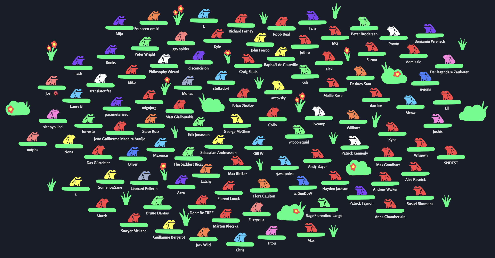
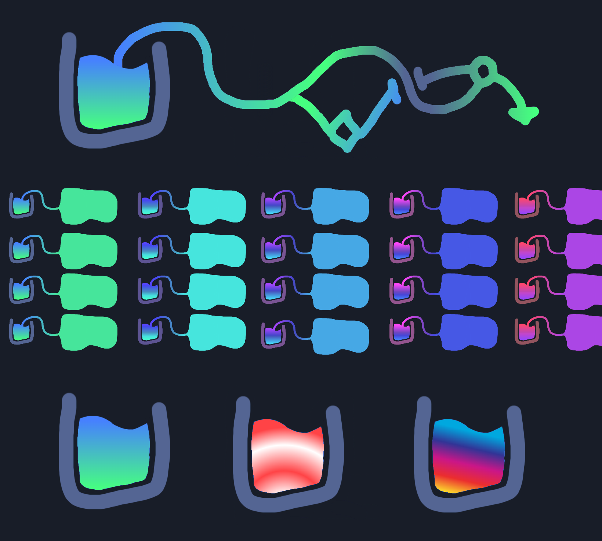
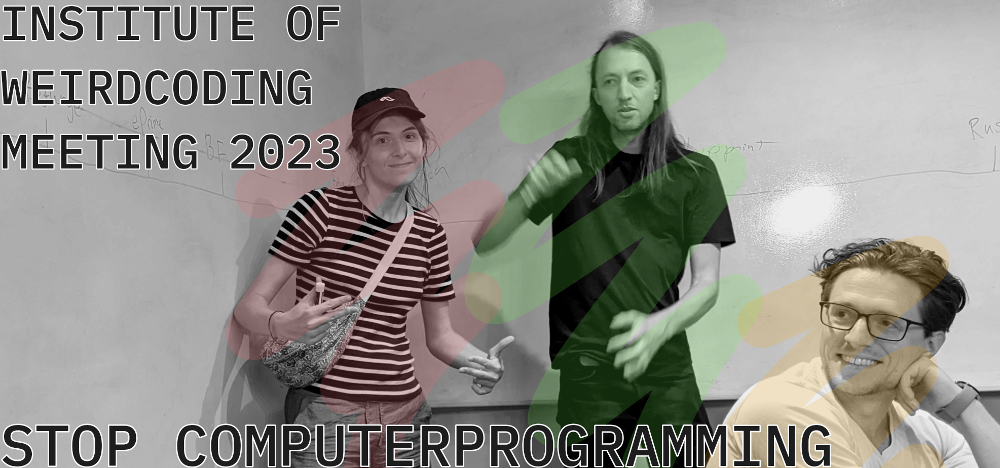
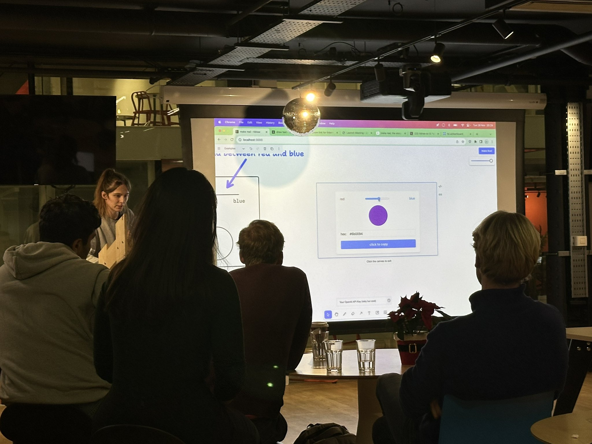

# 2023: Year of truth

Here's everything I released in 2023, the year of truth.

## SANDPOND SAGA: Define define

I made a [short film](https://youtu.be/ZMklf0vUl18) about definitions.

<iframe width="100%" src="https://www.youtube-nocookie.com/embed/ZMklf0vUl18" title="YouTube video player" frameborder="0" allow="accelerometer; autoplay; clipboard-write; encrypted-media; gyroscope; picture-in-picture; web-share" allowfullscreen></iframe>

## CELLPOND: Spatial programming pipe dream

I gave a [talk](https://www.youtube.com/live/L2U_Sd1qMJ4?t=2580) about [cellpond](https://github.com/TodePond/CellPond) at [london creative coding](https://www.meetup.com/london-creative-coding/), as part of [peckham digital](https://www.peckhamdigital.org/).

<iframe width="100%" src="https://www.youtube-nocookie.com/embed/L2U_Sd1qMJ4?start=2580&end=3929" title="YouTube video player" frameborder="0" allow="accelerometer; autoplay; clipboard-write; encrypted-media; gyroscope; picture-in-picture; web-share" allowfullscreen></iframe>

## FUTURE OF CODING: Intercal

I was a guest co-host on the [future of coding](https://futureofcoding.org/episodes/)'s [intercal episode](https://futureofcoding.org/episodes/064).

<iframe src="https://omny.fm/shows/future-of-coding/intercal-by-donald-woods-and-james-lyon/embed" width="100%" height="180" frameborder="0" style="margin-bottom: 1em"></iframe>

## DREAMBERD: Perfect programming language

I continued work on [dreamberd](https://github.com/TodePond/DreamBerd), and it [went](https://www.youtube.com/watch?v=tDexugp8EmM) [viral](https://youtube.com/shorts/-tCi-SX8vw8).

I gave a [talk](https://www.youtube.com/watch?v=52vmjZnxJb8) about it at [london future of coding](https://lu.ma/foclondon).

I was also interviewed about it on [mr the primeagen](https://www.twitch.tv/theprimeagen)'s livestream.

<iframe width="100%" src="https://www.youtube-nocookie.com/embed/-tCi-SX8vw8" title="YouTube video player" frameborder="0" allow="accelerometer; autoplay; clipboard-write; encrypted-media; gyroscope; picture-in-picture; web-share" allowfullscreen></iframe>

<iframe width="100%" src="https://www.youtube-nocookie.com/embed/tDexugp8EmM" title="YouTube video player" frameborder="0" allow="accelerometer; autoplay; clipboard-write; encrypted-media; gyroscope; picture-in-picture; web-share" allowfullscreen></iframe>

<iframe width="100%" src="https://www.youtube-nocookie.com/embed/52vmjZnxJb8" title="YouTube video player" frameborder="0" allow="accelerometer; autoplay; clipboard-write; encrypted-media; gyroscope; picture-in-picture; web-share" allowfullscreen></iframe>

The dreamberd virality got me up to 99 patrons on [patreon](https://patreon.com/TodePond)! Twice!

Thank you everyone.

## TODEPOND PONDCAST: Fractal bucket

I started a [weekly podcast](https://patreon.com/TodePond) for paying supporters.

I think my favourite episode was [fractal bucket](https://www.patreon.com/posts/todepond-fractal-89529064).

<audio controls>
  <source src="fractal-bucket.mp3" type="audio/mpeg">
</audio>

## INSTITUTE OF WEIRDCODING: Stop computerprogramming

Me and [ivan reese](https://ivanish.ca/) ran a session about weird coding at the [local-first unconference](https://lu.ma/localfirstswunconf-stlouis) as part of [strange loop](https://www.thestrangeloop.com/).

## CELLPOND: Spatial programming without escape

I made a new version of [cellpond](https://cellpond.cool/legacy/).

I gave a [talk](https://www.youtube.com/watch?v=cBYudbaqHAk&t=6704s) about it at [live](https://2023.splashcon.org/home/live-2023) as part of [splash](https://2023.splashcon.org/).

<iframe width="100%" src="https://www.youtube-nocookie.com/embed/cBYudbaqHAk?start=6704&end=8862" title="YouTube video player" frameborder="0" allow="accelerometer; autoplay; clipboard-write; encrypted-media; gyroscope; picture-in-picture; web-share" allowfullscreen></iframe>

## ARROOST: Normalise sharing scrappy fiddles

I made [arroost](https://github.com/TodePond/Arroost), a silly music-making tool.

I gave a [talk](https://www.youtube.com/watch?v=cF2OF75ivZM) about it at [london future of coding](https://lu.ma/foclondon).

<iframe width="100%" src="https://www.youtube-nocookie.com/embed/cF2OF75ivZM" title="YouTube video player" frameborder="0" allow="accelerometer; autoplay; clipboard-write; encrypted-media; gyroscope; picture-in-picture; web-share" allowfullscreen></iframe>

## TLDRAW: Make real

I made the viral [make real](https://tldraw.substack.com/p/make-real-the-story-so-far) demo as part of my work at [tldraw](https://tldraw.com). I also made [draw fast](https://twitter.com/tldraw/status/1727728068968460778) and [make happen](https://twitter.com/tldraw/status/1734624421623521719).

I was interviewed on the [thursdai show](https://thursdai.news/) about it.

I gave three talks about make real: At [ai tinkerers](https://aitinkerers.org/), [react advanced](https://guild.host/react-advanced-london/), and [supabase](https://supabase.com/blog/community-meetups-lwx) meetups.

## INK & SWITCH: Todepond

I was interviewed as part of an internal workshop at [ink & switch].

I have now joined ink & switch as a researcher-in-residence.

## FUTURE OF CODING: Myths and mythconceptions

I have now joined the [future of coding] podcast as a permanent co-host.

My [first episode] was just released.

My [first bonus episode] was also released.

## TADI WEB: The slippy mindset

I discovered the [tadi web] initiative for [better computing].

## TODEPOND DOT COM: Wikiblogarden

I made my [personal website], and started a daily [wikiblogarden].

## POND OF FAME: Choose your hero

I made a [dashboard] that lets paying supporters [claim their spot] in the [pond of fame].
